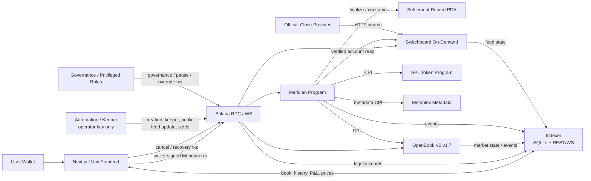
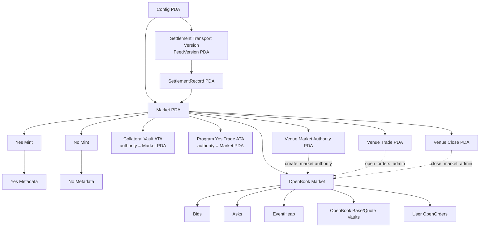
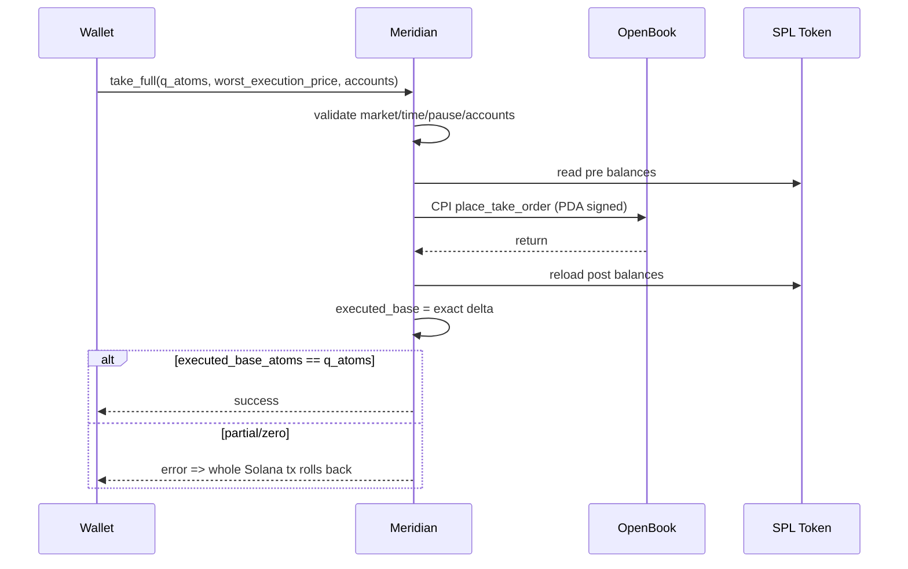
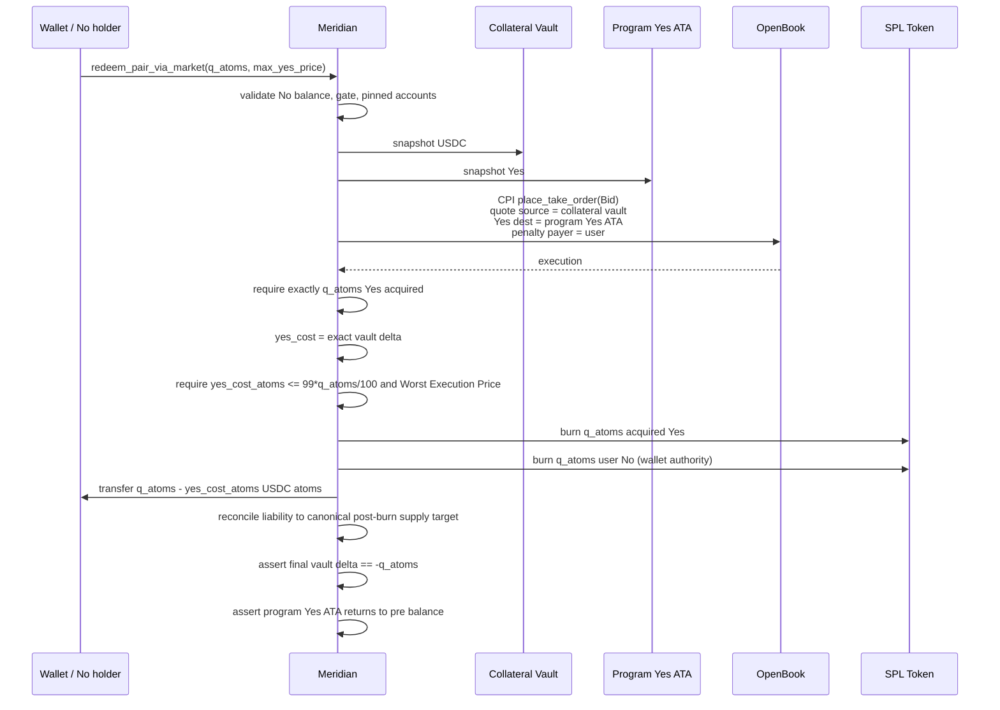

# Meridian — Architecture

**Version:** 1.1.1 (ADR-0030 G1 revision)
**Date:** 2026-08-20  
**Status:** M0 validation candidate; full build pending non-waiverable gates
**Product plan:** `docs/PRD.md` / Meridian Implementation Plan v0.7.1
**PRD SHA-256:** `1621c24df9a37e4b9fd6399f7c4ba8e419165ea636ea9326d113be40fbd3f089`
**Source specification:** `docs/REQUIREMENTS.md` (converted from the source PDF; the PDF remains source of truth when available)
**Primary venue:** OpenBook V2 deployed v1.7  
**Target:** Solana devnet

---

## 0. Document Authority and Change Control

This document is the implementation architecture derived from Meridian PRD v0.7 and reconciled with `CONTEXT.md` plus ADR-0001 through ADR-0028.

The PRD owns **product behavior and acceptance requirements**. This document owns **component boundaries, account topology, trust boundaries, CPI composition, service responsibilities, data flows, failure handling, and implementation structure**.

Accepted ADRs supersede conflicting text in the PRD and earlier architecture. The source specification owns product requirements; `CONTEXT.md` owns domain language; the PRD owns reconciled product behavior and acceptance requirements; this document owns implementation architecture.

### 0.1 Product decisions carried into architecture

Implementation MUST NOT change these without a new product/architecture decision:

- Solana devnet + Anchor/Rust.
- OpenBook V2 is the V1 CLOB.
- One Yes/USDC Venue Market per Outcome Market.
- Meridian PDA is the mandatory OpenBook `open_orders_admin`.
- OpenBook market expiry is `close_ts - 1`.
- All V1 limit orders are `PostOnly`.
- Market actions use full-fill-or-revert semantics.
- Minting is gated to `Active && mint_open_ts <= now < close_ts && !paused`.
- Buy No market = pair mint + full Yes sale.
- Buy No limit = pair mint + PostOnly Yes ask in one wallet approval.
- Sell No market = acquire missing Yes + pair redemption.
- Sell No limit is not V1.
- Every Outcome Market for a ticker and Trading Day consumes one immutable, atomically bound Settlement Record.
- Settlement uses the unadjusted Official Close published under the security's primary listing-market rules; for the V1 universe this is Nasdaq NOCP.
- Collateral uses an accounted liability ledger plus solvency (`raw >= accounted`), not raw-account equality.
- One outcome-token atom corresponds to one USDC atom.
- V1 has no protocol fees, fee configuration, treasury, or collateral-surplus withdrawal.
- The Directional Guardrail is frontend-enforced from fresh Position State; token ownership remains permissionless.
- Direct Pair Redemption is available before and after Settlement.
- Circle's six-decimal Solana Devnet USDC mint is the integration quote asset.
- Outcome-token metadata is permanent and must be published and verified before mint creation.
- Devnet end-to-end is a pass requirement.
- The deterministic synthetic demo and the real-provider oracle proof are separate required paths.
- M0 gates G1–G12 are a non-waiverable safety boundary before full implementation, except for the named first-use Buy-No one-approval product waiver.

### 0.2 Architecture-level choices frozen by this document

The following are implementation details established here. Changing them requires an Architecture revision but does not require a PRD revision unless user-visible behavior changes:

- canonical Meridian PDA seed scheme;
- immutable Settlement Transport Version (`FeedVersion` account) and `SettlementRecord` records live in separate Meridian PDA accounts;
- collateral vault and transient Yes trading account use the Meridian Market PDA as token authority;
- indexer is read-only and never participates in custody or protocol authority;
- automation holds only the `operator` hot key;
- on-chain CPI targets are allowlisted;
- explicit stable wire discriminants, account schema versions, and reserved padding;
- operator-funded closable accounts snapshot their Rent Refund Address;
- event/indexer APIs and failure-mode boundaries below.

---

## 1. Architecture Goals

### 1.1 Correctness

The architecture must make the following properties easier to prove than to violate:

1. every outstanding $1 liability is collateralized;
2. Yes + No settlement payout is exactly $1;
3. no order can be created outside the trading window or while paused;
4. no OpenBook account supplied by a client can redirect Meridian custody or authority flows;
5. settlement cannot accept a fresh publication of an old closing observation;
6. issued Outcome Market terms cannot be changed retroactively;
7. partial synthetic execution cannot persist;
8. unsolicited collateral cannot be withdrawn or confused with Collateral Liability;
9. all Outcome Markets for one ticker and Trading Day settle from the same final Settlement Record.

### 1.2 Non-custodial boundaries

Meridian may control program-owned vaults required for fully collateralized issuance, but:

- protocol access is wallet-based and introduces no identity/KYC service or account;
- no lending, borrowing, margin, leverage, or unsecured-short dependency/path exists;
- user wallet signing is required for Meridian Redemption of user-owned tokens, but classic SPL holders may also burn their own tokens directly as unsupported voluntary forfeiture;
- automation cannot withdraw collateral;
- governance cannot rewrite live-market settlement rules;
- indexer/frontend never hold signing authority;
- OpenBook custody is limited to user-created OpenOrders balances and venue vault mechanics;
- cancellation, fund settlement, Pair Redemption, and Outcome Redemption remain available when new Directional Intents are paused.

### 1.3 Operational clarity

The architecture separates:

- **write path:** wallet/automation -> Meridian/OpenBook/Switchboard on Solana;
- **read path:** Solana/OpenBook/Switchboard -> indexer -> REST/WS -> frontend;
- **automation path:** operator jobs + EventHeap keeper + settlement orchestration;
- **governance path:** cold/separate authorities, not service hot keys.

---

## 2. System Context



### 2.1 Sources of truth

| Domain                       | Source of truth                                   |
| ---------------------------- | ------------------------------------------------- |
| Yes/No ownership             | SPL token accounts                                |
| Collateral Liability         | Meridian `Market.collateral_liability_atoms`      |
| raw collateral               | SPL collateral vault balance                      |
| order book                   | OpenBook market/bids/asks                         |
| resting/open order ownership | OpenBook OpenOrders accounts                      |
| Outcome Market lifecycle     | Meridian `Market.state` + timestamps/flags        |
| venue expiry                 | OpenBook `time_expiry`, cross-checked by Meridian |
| Official Close evidence      | immutable Meridian `SettlementRecord`             |
| Settlement outcome           | `SettlementRecord.official_close >= Market.strike` |
| Collateral Surplus           | raw vault atoms minus Collateral Liability        |
| History / P&L                | indexer, advisory/read-side with completeness     |
| Directional Guardrail        | fresh Position State, not consensus state         |

---

## 3. Trust Boundaries

### 3.1 Untrusted inputs

Treat all of the following as attacker-controlled:

- browser/frontend arguments;
- RPC responses until account ownership/data are validated;
- user-supplied Solana accounts;
- OpenBook market/account addresses supplied by clients;
- OpenOrders accounts supplied by transaction builders;
- remaining maker accounts supplied for inline settlement;
- feed and Settlement Record accounts supplied to finalization/settlement;
- timestamps/price bounds supplied by clients;
- token destination/source accounts;
- indexer output;
- automation request payloads.

The program derives or validates all security-sensitive identities on-chain.

### 3.2 Trusted but constrained dependencies

#### Meridian program

Protocol trust root for:

- collateral accounting;
- token mint/burn authority;
- trading authorization;
- market snapshots;
- settlement;
- Settlement Record finalization.

#### OpenBook V2

Trusted only for the pinned/deployed venue behavior proven by M0:

- matching;
- OpenOrders custody/accounting;
- market expiry;
- event heap behavior;
- zero-fee accounting and required administrator-field behavior.

Meridian MUST validate the exact attached market configuration before using it.

#### Public feed delivery

Switchboard On-Demand is the initial delivery path, not the source of truth. Meridian validates:

- feed identity;
- owner program;
- feed hash;
- publication time;
- record identity, Trading Day, and observation time;
- sample/freshness;
- provider finality, Close Method, and price normalization/band.

#### Stock-data provider

External publication source for the Official Close. Selection is a go/no-go calibration against the frozen Settlement Record contract and cannot weaken it.

### 3.3 Privileged roles

| Role                      | Hot/cold posture       | Powers                                                                                      | Explicitly cannot do                                  |
| ------------------------- | ---------------------- | ------------------------------------------------------------------------------------------- | ----------------------------------------------------- |
| `operator`                | hot automation key     | create/add/create-venue/attach/abandon eligible empty Outcome Markets; pay venue rent; keeper and calendar orchestration | hold a venue authority, pause issued markets, settle by privilege, override, or withdraw collateral |
| `pause_authority`         | separate               | global/per-market pause, one-way bounded-reason permanent pause, conditional Emergency Expiry after M0 | settle or mutate terms                                |
| `override_authority`      | isolated cold key on demo devnet; mandatory multisig for non-demo | after the immutable delay, attest two normalized equal manual values and their evidence manifest | bypass delay/equality/digest checks, choose an outcome bit directly, create, or trade |
| `governance`              | cold/separate          | two-step Config-role rotation, future settlement params, Settlement Transport Version registration/activation | rewrite Outcome Market or Settlement Record snapshots  |
| program upgrade authority | dedicated cold deployer | program upgrades during the proof-of-concept milestones; publish program-data/hash/slot proof | load into services; non-demo use without multisig       |

Governance proposes replacements for every Config role—governance, operator, Pause Authority, and Override Authority—and the incoming key must accept. Operational roles cannot rotate themselves. Program upgrade authority transfers through the Solana loader rather than Config governance. Transfer of program upgrade authority to the published 2-of-3 multisig is a mandatory final-demo acceptance gate; every non-demo deployment requires multisignature control for both program upgrades and Manual Settlement Override.

---

## 4. Component Architecture

### 4.1 `programs/meridian`

Responsibilities:

- config + role validation;
- Settlement Transport Version registry and canonical Settlement Records;
- Outcome Market lifecycle;
- Yes/No mint/metadata/vault creation;
- collateral liability accounting;
- permissionless supply-based liability reconciliation;
- mint/pair redemption/outcome redemption;
- mandatory OpenBook order gateway;
- pinned OpenBook Venue Market creation wrapper;
- OpenBook CPI adapter;
- settlement validation;
- Collateral Surplus observation without withdrawal;
- events.

Must not contain:

- HTTP calls;
- NYSE calendar logic;
- P&L/history calculations;
- arbitrary external CPI addresses;
- frontend-derived authority assumptions.

### 4.2 `packages/common`

Pure/shared TypeScript domain logic:

- ticker enum;
- strike engine;
- NYSE calendar;
- fixed-point helpers;
- address derivation;
- transaction composition helpers;
- shared error/result types.

No secrets.

### 4.3 `packages/openbook-adapter`

Boundary around OpenBook client/types.

Responsibilities:

- decode pinned OpenBook accounts;
- derive OpenOrdersIndexer/OpenOrders addresses using official client rules;
- build recovery instructions such as cancel and consumed-event helpers;
- build account lists for Meridian wrappers;
- expose normalized market/book/OpenOrders types;
- golden-test against pinned v1.7 client.

Application code outside this package does not import raw OpenBook/web3.js/Anchor venue types.

### 4.4 `services/automation`

Single service may host multiple workers, but responsibilities remain logically separated:

- strike creation scheduler;
- intraday `add_strike` runner;
- EventHeap keeper;
- Settlement preflight;
- public feed-update orchestration;
- settlement runner;
- corporate-action blackout checks;
- post-close cleanup;
- alerts/health.

Each worker is triggered by the substrate that matches its nature — the
settlement and market-creation runners fire from a **durable scheduler** at the
lifecycle times fixed in PRD §5, and the EventHeap keeper is driven by an
**account subscription** (idle in the inline-first common path, §8.3), *not* a
shared per-second polling loop (ADR-0031). At-least-once scheduling is safe
because every action is idempotent on-chain. The always-on second-by-second
loop in `services/keeper` is a localnet-demo affordance and is explicitly not the
production shape; production topology (scheduler substrate, redundancy, secrets,
observability) is `docs/PRODUCTION_INFRA.md`.

Only `OPERATOR_KEYPAIR_PATH` is loaded by the service.

### 4.5 `services/indexer`

Read-only projection layer.

Responsibilities:

- consume Meridian logs;
- consume/decode OpenBook state/events;
- discover per-wallet OpenOrders through OpenOrdersIndexer;
- maintain order-book ladder;
- subscribe to the eligible SIP-derived feed for Live Underlying Price display;
- calculate platform-execution P&L;
- maintain History Completeness and Position State projections;
- expose REST/WS;
- expose EventHeap health.

It owns no protocol key and cannot write protocol state.

### 4.6 `frontend`

Next.js + Umi.

Responsibilities:

- wallet connection;
- market discovery;
- real-time price/book display;
- Yes/No mirrored view;
- Directional Guardrail and Recovery-only Mode;
- transaction construction/signing;
- recovery UX;
- portfolio/history.

All order creation calls Meridian, never OpenBook directly.

---

## 5. On-Chain Account Topology



### 5.1 Canonical Meridian PDA seeds

These are architecture-level constants:

```text
Config:
  ["config"]

Market:
  ["market", ticker_u8, strike_1e6_le_u64, trading_day_yyyymmdd_le_u32]

SettlementRecord:
  ["settlement-record", ticker_u8, trading_day_yyyymmdd_le_u32]

Yes mint:
  ["yes", market_pubkey]

No mint:
  ["no", market_pubkey]

Settlement Transport Version (`FeedVersion` account):
  ["feed-version", ticker_u8, version_id_le_u32]

Venue market authority:
  ["venue-market-authority", market_pubkey]

Venue trade authority:
  ["venue-trade", market_pubkey]

Venue close authority:
  ["venue-close", market_pubkey]
```

Token accounts:

```text
collateral_vault =
  ATA(owner = Market PDA, mint = quote_mint)

program_yes_trade_ata =
  ATA(owner = Market PDA, mint = yes_mint)

```

Changing any seed after deployment is a breaking account-address migration.

Wire discriminants are permanent and explicit: `TickerId (u8)` is `0 = Invalid`, `1 = AAPL`, `2 = AMZN`, `3 = GOOGL`, `4 = META`, `5 = MSFT`, `6 = NVDA`, `7 = TSLA`; `MarketState (u8)` is `0 = Uninitialized`, `1 = Created`, `2 = Active`, `3 = Settled`, `4 = Abandoned`; `Outcome (u8)` is `0 = Unset`, `1 = Yes`, `2 = No`; `SettlementRecordState (u8)` is `0 = Pending`, `1 = FinalOracle`, `2 = FinalManual`; and `HaltOrContingencyStatus (u8)` is `0 = Invalid`, `1 = NormalOfficialClose`, `2 = OfficialCloseAfterHalt`, `3 = OfficialContingencyClose`. All other values are reserved and declaration order is never serialized implicitly. A day with no Official Close never reaches a final SettlementRecord state. The user-visible Market Phase is a projection, not `MarketState`. Config, Settlement Transport Version (`FeedVersion`), SettlementRecord, and Market accounts carry `schema_version: u8` plus `[u8; 64]` reserved padding. IDs are never reused, and golden PDA/digest vectors cover every canonical identity, enum, and status value.

### 5.2 Account ownership matrix

| Account                          | Owning program | Authority / signer                                 |
| -------------------------------- | -------------- | -------------------------------------------------- |
| Config                           | Meridian       | role checks                                        |
| Settlement Transport Version    | Meridian       | immutable after creation                           |
| SettlementRecord                 | Meridian       | header immutable after initialization; result/state written once at finalization |
| Market                           | Meridian       | program                                            |
| Yes/No Mint                      | SPL Token      | Market PDA mint authority                          |
| Yes/No ATA                       | SPL Token      | wallet / program-specific owner                    |
| metadata                         | Metaplex       | immutable                                          |
| collateral vault                 | SPL Token      | Market PDA                                         |
| program Yes trade ATA            | SPL Token      | Market PDA                                         |
| OpenBook market/book/heap/vaults | OpenBook       | configured admins / OpenBook                       |
| OpenOrders                       | OpenBook       | user owner/delegate                                |
| public settlement feed           | Switchboard    | external delivery; identity/verifier snapshotted   |

### 5.3 Mint policy

Yes and No:

- classic SPL Token;
- 6 decimals;
- mint authority = Market PDA;
- no freeze authority;
- metadata `update_authority = Market PDA` and `is_mutable = false`;
- token creation only through `mint_pair`.

No Token-2022 extension is assumed.

Before mint creation, automation serializes each Yes/No metadata JSON document as RFC 8785 canonical UTF-8 bytes, hashes the exact JSON and image bytes, uploads them to production Arweave, and verifies every digest through two gateways. IPFS is only an explicit fallback with a raw CID and two independent pins. Publication or verification failure aborts Outcome Market creation. Gateway verification is off-chain; the program binds the submitted URI/content hashes, re-derives the fixed manifest root below, and validates the Metaplex mint/metadata relationships and immutable flags.

---

## 6. Meridian Data Model

### 6.1 Config

Logical fields:

```text
roles:
  governance
  pending_governance
  operator
  pending_operator
  pause_authority
  pending_pause_authority
  override_authority
  pending_override_authority

global:
  schema_version: u8
  reserved_padding: [u8; 64]
  quote_mint
  token_program
  quote_decimals
  supported_ticker_mask
  paused

openbook identity:
  openbook_program_id
  openbook_programdata
  openbook_deployment_slot: u64
  openbook_executable_sha256: [u8; 32]
  openbook_upgrade_authority: Pubkey # all-zero/None required

settlement defaults:
  current settlement parameters
  future-day activation record

feeds:
  current_transport_version_pubkey[8]
  pending_transport_version_pubkey[8]
  pending_transport_activation_day[8]
  latest_created_trading_day[8]
```

These arrays are indexed by permanent `TickerId`; slot 0 is the invalid sentinel and must remain zeroed.

The full immutable transport/provider history is stored in separate Settlement Transport Version (`FeedVersion`) PDAs rather than resizing Config indefinitely.

The quote mint is pinned for integration to Circle Solana Devnet USDC `4zMMC9srt5Ri5X14GAgXhaHii3GnPAEERYPJgZJDncDU`; Config initialization validates classic SPL ownership and six decimals. Local deterministic tests use an explicitly named six-decimal test USD mint.

Compile-time constant:

```text
MIN_OVERRIDE_DELAY_SECS = 3600
MIN_ADD_STRIKE_LEAD_SECS = 1800
DEVNET_NORMAL_SETTLEMENT_DELAY_SECS = 1200
MIN_SETTLEMENT_SAMPLES = 2
MAX_SETTLEMENT_SAMPLES = 32
MIN_SETTLEMENT_STALE_SLOTS = 1
MAX_SETTLEMENT_STALE_SLOTS = 450
MIN_SETTLEMENT_PRICE_BAND_BPS = 1
MAX_SETTLEMENT_PRICE_BAND_BPS = 5000
OUTCOME_TOKEN_DECIMALS = 6
QUOTE_TOKEN_DECIMALS = 6
```

Config initialization and `set_params` enforce those inclusive sample/stale/band bounds and `max_sample_spread_bps = 0`. G11 must publish the empirically selected `min_samples`, `max_stale_slots`, and `max_price_band_bps` in signed `docs/adr/settlement-quality-calibration.md` before M1. Changes remain future-Trading-Day-only and never alter a Pending header.

### 6.2 Settlement Transport Version (`FeedVersion` account)

```text
schema_version: u8
reserved_padding: [u8; 64]
version_id: u32
ticker_id: u8
switchboard_program_id
switchboard_programdata
switchboard_deployment_slot: u64
switchboard_executable_sha256: [u8; 32]
switchboard_upgrade_authority: Pubkey # all-zero means None
switchboard_feed
switchboard_job_hash
provider_id
close_method_id
activated_trading_day
```

Rules:

- append-only;
- never modified after registration;
- governance uses `register_settlement_transport_version` and may use `activate_settlement_transport_version` only for future Trading Days;
- an Outcome Market stores its exact Settlement Transport Version identity and fields;
- version IDs start at one, increase monotonically per ticker, and are never reused.

The Switchboard executable identity is part of each immutable version. Registration verifies the executable owner, Upgradeable Loader-derived ProgramData address, deployment slot, current upgrade-authority field, and an independently reproduced executable SHA-256. The hash is an off-chain published audit commitment, not an on-chain hashing claim. `finalize_settlement_record` receives the version's ProgramData read-only and verifies its owner, derived address, exact deployment slot, and exact authority while that account is read-locked for the transaction. An immutable deployment is preferred. If an external retained authority upgrades or rotates it, normal finalization fails closed; a new version may activate only for future Trading Days, and an already-Pending record remains bound to the old identity and uses the delayed Manual path rather than silently trusting new code.

Every creation monotonically updates `latest_created_trading_day[ticker_id]`. On-chain scheduling requires a new activation day later than that value; automation also verifies it is a future NYSE Trading Day. For a target Trading Day, the resolver selects pending when the target is on/after `pending_transport_activation_day`, otherwise current. Installing another version first promotes any already-effective pending entry to current; if the existing pending entry is not effective yet, replacement rejects. The new pointer/day cannot alter resolution for an earlier Trading Day. Every creation path and Pending SettlementRecord initialization uses this resolver, so same-day Add Strike remains on the same header.

### 6.3 SettlementRecord

One canonical record is shared by every Outcome Market for a ticker and Trading Day. The first Outcome Market creation initializes the immutable header; later Strikes must match it exactly:

```text
state: u8                         # 0 Pending, 1 FinalOracle, 2 FinalManual

header:
  schema_version: u8
  ticker_id: u8
  trading_day: u32                 # YYYYMMDD
  close_ts: i64
  prior_official_close_1e6: u64
  settlement_transport_version_id: u32
  switchboard_program_id: Pubkey
  switchboard_programdata: Pubkey
  switchboard_deployment_slot: u64
  switchboard_executable_sha256: [u8; 32]
  switchboard_upgrade_authority: Pubkey # all-zero means None
  switchboard_feed: Pubkey         # 32 bytes
  switchboard_job_hash: [u8; 32]
  provider_id: u16
  close_method_id: u16
  normal_settlement_delay_secs: u32
  min_samples: u8
  max_stale_slots: u64
  max_sample_spread_bps: u16
  max_price_band_bps: u16
  override_delay_secs: u32

common result (zeroed while Pending; written atomically with state):
  official_close_1e6: u64
  halt_or_contingency_status: u8
  is_final: u8                     # must be exactly 1
  is_unadjusted: u8                # must be exactly 1
  finalized_ts: i64

FinalOracle-only result:
  official_close_observed_ts: i64
  exchange_published_ts: i64
  provider_observed_ts: i64
  provider_revision_hash: [u8; 32] # SHA-256 of canonical opaque revision bytes
  source_record_id_hash: [u8; 32]
  raw_response_sha256: [u8; 32]
  delivery_update_slot: u64
  sample_count: u8
  sample_spread_bps: u16

FinalManual-only result:
  manual_source_a_value_1e6: u64
  manual_source_b_value_1e6: u64
  override_reason_code: u16
  manual_evidence_manifest_sha256: [u8; 32]

reserved_padding: [u8; 64]
```

The header is initialized only from program-validated Config, schedule, prior-close, transport, quality, and delay values. Creation of every later Outcome Market for the tuple compares those fields byte-for-byte before proceeding. V1 sets `max_sample_spread_bps = 0`; this is a special exact-equality rule over normalized `u64` sample values, not a rounded basis-point calculation. `max_stale_slots` means only `submission_slot - delivery_update_slot`: anyone may refresh or redeliver the same immutable provider record identity and revision hash, but a fresh delivery slot cannot change or launder its Trading Day, observation/publication timestamps, revision hash, record ID, or raw-response digest.

The zeroed result transitions once from Pending to a valid FinalOracle result or, after the delay, FinalManual; first valid finalization wins. FinalOracle requires every common and FinalOracle-only field, with all FinalManual-only fields zero. FinalManual requires the two equal source values, reason, and manual manifest digest; its common fields are populated, while every FinalOracle-only field is zero. Every unused result field must be zero, so state-dependent population is canonical. Anyone may pay to refresh the public delivery account, finalize a normal result, reconcile liability, and settle Outcome Markets; manual finalization additionally requires the Override Authority. The account is retained permanently and has no mutable external authority or close instruction.

Consensus commitments use fixed-field Borsh structs, never raw account bytes:

```text
header_digest = SHA256(
  "MERIDIAN_SETTLEMENT_HEADER_V1" || borsh(HeaderCommitmentV1)
)

result_digest = SHA256(
  "MERIDIAN_SETTLEMENT_RESULT_V1" || borsh(ResultCommitmentV1)
)
```

`HeaderCommitmentV1` contains the header fields above in declaration order. `ResultCommitmentV1` contains `state`, every common result field, every FinalOracle-only field, and every FinalManual-only field in declaration order. Account discriminators and reserved padding are excluded. Outcome Markets store `result_digest` as `settlement_record_digest`; golden vectors freeze both domains, widths, endianness, ordering, zero rules, and digests.

### 6.4 Outcome Market (`Market` account)

Use explicit fields; do not serialize a generic parameter blob.

```text
identity:
  schema_version: u8
  reserved_padding: [u8; 64]
  ticker_id
  strike_1e6
  trading_day
  prior_official_close_1e6

lifecycle:
  mint_open_ts
  trade_open_ts
  close_ts
  state
  activity_started
  paused
  emergency_expired
  emergency_expired_ts
  emergency_reason_code

outcome:
  settlement_price_1e6
  outcome
  settled_ts
  settlement_record
  settlement_record_digest
  manual_settled

assets:
  yes_mint
  no_mint
  collateral_vault
  program_yes_trade_ata

venue:
  openbook_market
  openbook_market_authority: Pubkey
  bids
  asks
  event_heap
  openbook_base_vault
  openbook_quote_vault
  venue_market_authority_bump
  venue_trade_authority_bump
  venue_close_authority_bump

settlement transport snapshot:
  settlement_transport_version_id
  switchboard_program_id
  switchboard_programdata
  switchboard_deployment_slot
  switchboard_executable_sha256
  switchboard_upgrade_authority
  switchboard_feed
  switchboard_job_hash
  provider_id
  close_method_id

settlement snapshot:
  normal_settlement_delay_secs
  min_samples
  max_stale_slots
  max_sample_spread_bps
  max_price_band_bps
  override_delay_secs

metadata:
  yes_metadata_uri_hash
  yes_metadata_sha256
  yes_image_uri_hash
  yes_image_sha256
  no_metadata_uri_hash
  no_metadata_sha256
  no_image_uri_hash
  no_image_sha256
  metadata_manifest_sha256

rent refunds:
  market_rent_refund_address
  venue_rent_refund_address

accounting:
  collateral_liability_atoms

safety flags:
  permanent_pause_reason
```

The shared creation primitive validates that Config is not globally paused, a supported ticker, positive `$10`-multiple Strike, positive prior Official Close, a 30-minute mint-to-trade interval, a 3.5- or 6.5-hour trading session, canonical identity/assets, zero liability, and the deterministically resolved Settlement Transport Version. Every current-Trading-Day call—whether exposed as morning creation or Add Strike—requires `Clock.now <= close_ts - MIN_ADD_STRIKE_LEAD_SECS`, including early closes. It initializes the canonical ticker/day SettlementRecord Pending header if absent; otherwise every schedule, prior-close, transport, quality, and delay field must match. `normal_settlement_delay_secs` is at least `DEVNET_NORMAL_SETTLEMENT_DELAY_SECS` on devnet, and no future Config change mutates the header. Venue attachment/activation also fails while Config is globally paused. The program still trusts the operator and audited calendar automation for whether the date is an NYSE Trading Day and the supplied market facts are true.

Every operator-funded closable account snapshots its Rent Refund Address at creation. User-funded OpenBook rent returns only to the payer/owner under supported venue closure rules.

The 32-byte metadata manifest root uses this exact order and domain separator:

```text
SHA256(
  "MERIDIAN_METADATA_V1" ||
  yes_metadata_uri_hash || yes_metadata_sha256 ||
  yes_image_uri_hash    || yes_image_sha256    ||
  no_metadata_uri_hash  || no_metadata_sha256  ||
  no_image_uri_hash     || no_image_sha256
)
```

`activity_started` is false at creation and monotonic. The first successful mint or Meridian order authorization sets it true in the same transaction. Abandonment is available from Created or Active only while this flag is false and liability, token supplies, orders, EventHeap, and venue balances are all empty. The Market account remains as an Abandoned tombstone; only M0-proven child/venue accounts close to their snapshotted refund destinations.

### 6.5 State machine

```mermaid
stateDiagram-v2
    [*] --> Created: create_strike_market
    Created --> Created: create_venue_market<br/>store canonical venue; remain inactive
    Created --> Active: attach_venue
    Created --> Abandoned: abandon_market<br/>activity_started=false / empty
    Active --> Abandoned: abandon_market<br/>activity_started=false / empty
    Active --> Settled: settle_market(SettlementRecord)
    Abandoned --> [*]
    Settled --> [*]
```



Time overlays on `Active`:

```text
before mint_open_ts                -> no mint
mint_open_ts .. trade_open_ts      -> mint allowed, no trading
trade_open_ts .. close_ts          -> mint + trading allowed
at/after close_ts                  -> no mint, no order creation
settled                            -> Pair Redemption + Outcome Redemption
```

Pause overlays Active:

- global pause blocks Outcome Market creation, Add Strike, Venue Market creation, and Venue Market attachment/activation;
- blocks minting;
- blocks directional trading;
- does not block cancel, event consumption, fund settlement, liability reconciliation, Settlement Record finalization, Outcome Market Settlement, or non-matching Redemption.

Resting orders are not mutated by pause and may fill again only after every applicable global and per-market pause is explicitly and safely cleared. An empty Outcome Market may become terminally Abandoned before issuance; V1 never recreates the same ticker, Strike, and Trading Day identity after immutable asset accounts exist. Once issuance or order activity occurs, an erroneous Outcome Market is permanently paused while recovery and Settlement remain available.

User-visible Market Phase is the first matching row in this precedence table, evaluated from finalized state and calendar time:

| Precedence | Predicate | Market Phase |
|---:|---|---|
| 1 | `state == Abandoned` | Abandoned |
| 2 | `state == Settled` | Settled |
| 3 | `emergency_expired == true` | Emergency expired |
| 4 | `now >= close_ts + 25m && state != Settled` | Settlement delayed |
| 5 | `now >= close_ts && state != Settled` | Closed awaiting Settlement |
| 6 | `paused || Config.paused` | Paused |
| 7 | `state == Created` | Preparing |
| 8 | `state == Active && now < mint_open_ts` | Scheduled |
| 9 | `state == Active && mint_open_ts <= now < trade_open_ts` | Minting |
| 10 | `state == Active && trade_open_ts <= now < close_ts` | Trading |

Settlement Disputed is a separate evidence status displayed alongside Settlement delayed; post-close temporary or permanent pause does not hide settlement progress. After a successfully settled Emergency-expired Venue Market, Settled takes precedence.

---

## 7. OpenBook Integration Boundary

### 7.1 Pinned dependency

V1 expects:

```text
program id:
opnb2LAfJYbRMAHHvqjCwQxanZn7ReEHp1k81EohpZb

deployed tag:
v1.7

release commit:
796a470

release build SHA-256:
a3eb0fad20778b31a20c6b98e4e61b8e9425ccbfb27a96f8165f70c0381bafa8
```

These values are inputs to G1 but are independently verified before implementation relies on them.

Because OpenBook is custody-critical external code, G1 also publishes its executable owner, Upgradeable Loader-derived ProgramData address, deployment slot, executable SHA-256, and upgrade-authority state. Config accepts the verified canonical deployment; per ADR-0030 its retained external upgrade authority is a monitored fail-closed risk (the artifact's compiled-in program ID makes an immutable re-deployment impossible). `initialize_config` and every OpenBook wrapper require the exact program plus read-only ProgramData account and verify the stored owner/address/slot identity before CPI; tooling independently checks the hash and automation alerts on any authority or deployment-state change. A changed slot, owner/address mismatch, or executable-hash mismatch fails closed and reopens the architecture.

### 7.2 Integration implementation

Preferred:

1. MIT `cpi`/`client` interface compatible with pinned deployment.
2. If incompatible with Meridian's Anchor version, build a minimal adapter only from MIT IDL/client/account-layout interfaces.
3. Golden-test:
   - discriminator;
   - serialized arguments;
   - account order;
   - signer/writable flags;
   - program ID.

Do not derive fallback code from GPL implementation source.

### 7.3 Meridian-owned OpenBook market creation

The Operator cannot create an attachable Venue Market by calling OpenBook directly. `create_venue_market` is the only supported creation path. It requires an unpaused Config, a `Created` Outcome Market with no stored Venue Market, the derived `venue_market_authority` PDA, the canonical Yes/quote mints, and the exact OpenBook accounts to initialize. The Operator is a writable SOL payer for all market/book/EventHeap/vault rent but is not a venue authority. Meridian invokes the pinned OpenBook create instruction with `venue_market_authority` as the sole authority signer and stores the returned Venue Market identity/accounts while the Outcome Market remains `Created`.

Per strike:

```text
market_authority      = venue_market_authority PDA
base_mint            = Yes mint
quote_mint           = Config.quote_mint
open_orders_admin    = venue_trade_authority PDA
collect_fee_admin    = ZERO_FEE_UNSIGNABLE_SENTINEL
consume_events_admin = None
close_market_admin   = venue_close_authority PDA
time_expiry          = close_ts - 1
oracle_a             = None
oracle_b             = None
maker_fee            = 0
taker_fee            = 0
```

OpenBook v1.7 requires a `collect_fee_admin` public key even for a zero-fee market. V1 uses an intentionally unsignable sentinel proven by M0, never a Meridian PDA or service-controlled key.

Lot parameters:

```text
base_lot_size  = 1_000_000 base atoms
quote_lot_size = 10_000 quote atoms
price_lots     = cents
```

The wrapper constructs these values; no caller-supplied header/admin/fee/expiry/oracle/lot value is forwarded unchecked. It verifies the target accounts are the expected uninitialized or just-created accounts, verifies post-CPI ownership and decoded header fields, and snapshots the Operator's Venue Rent Refund Address. Meridian exposes no wrapper for a post-create change to market authority, admins, fees, expiry, oracles, or lot sizes. If the pinned OpenBook program has a mutation path callable without an unavailable authority, G1 fails and this architecture must reopen.

### 7.4 Attach-time validation

`attach_venue` accepts a venue only if every invariant matches:

```text
owner                == PINNED_OPENBOOK_PROGRAM_ID
openbook_market      == Market.openbook_market stored by create_venue_market
market_authority     == Market.openbook_market_authority
market_authority     == derived venue-market-authority PDA
base_mint            == Market.yes_mint
quote_mint           == Config.quote_mint
base_lot_size        == 1_000_000
quote_lot_size       == 10_000
open_orders_admin    == derived venue-trade PDA
collect_fee_admin    == ZERO_FEE_UNSIGNABLE_SENTINEL
consume_events_admin == None
close_market_admin   == derived venue-close PDA
time_expiry          == close_ts - 1
maker_fee            == 0
taker_fee            == 0
oracle_a             == None
oracle_b             == None
```

The program also stores and pins:

- bids;
- asks;
- EventHeap;
- OpenBook base vault;
- OpenBook quote vault.

After attachment, no client-provided replacements are accepted.

Every OpenBook authority is either `None`, the proven unsignable sentinel, or a Meridian PDA that signs only through explicitly allowlisted wrappers. `venue_market_authority` signs only the one creation wrapper; it has no post-create mutation wrapper. No operator or service key is retained. M0 enumerates every pinned OpenBook instruction capable of editing Market header/admin/fee/expiry/oracle/lot fields; any permissionless edit or retained external authority fails the architecture.

### 7.5 Mandatory order gateway

Every supported order creation is a Meridian instruction.

Common gate:

```text
Market.state == Active
trade_open_ts <= Clock.now < close_ts
!Config.paused
!Market.paused

openbook_program == pinned program id
openbook_programdata == Config.openbook_programdata
decoded ProgramData owner/derived address/slot/authority == immutable Config identity
openbook_market  == stored market
bids/asks/heap   == stored accounts
venue vaults     == stored vaults
decoded owner/mints/market authority == stored expected values
decoded market authority == derived venue-market-authority PDA
decoded lot sizes == 1_000_000 / 10_000
decoded open_orders_admin == derived venue-trade PDA
decoded collect_fee_admin == unsignable sentinel
decoded consume_events_admin == None
decoded close_market_admin == derived venue-close PDA
decoded time_expiry == close_ts - 1
decoded maker_fee/taker_fee == 0
decoded oracle_a/oracle_b == None

price_lots in [1, 99]
quantity is integral whole-token lots
```

Instruction quantities remain atom-denominated. Venue-backed actions require `quantity_atoms > 0 && quantity_atoms % 1_000_000 == 0`; invalid quantities are rejected rather than rounded. Minting, direct Pair Redemption, and Outcome Redemption accept any positive atom count.

Meridian uses `invoke_signed` for `venue_trade_authority`. The complete decoded header is revalidated on every order wrapper as defense-in-depth; attachment alone is insufficient. G7 measures the CU/account impact of this revalidation.

A direct OpenBook order-creation call cannot produce the PDA signature and therefore cannot trade. The indexer may improve transaction construction but is never an authorization source.

### 7.6 Normal venue cleanup

If M0 proves the pinned OpenBook prune/close instructions and their account semantics, Meridian exposes permissionless `prune_expired_venue` and `close_venue` wrappers. Both require post-close state, pin the stored Venue Market/book/EventHeap/vault accounts, and sign only with `venue_close_authority`. `close_venue` additionally proves all venue state and balances empty and pins every recoverable operator-funded rent destination to the snapshotted Venue Rent Refund Address; callers cannot supply a replacement. Unsupported close paths remain unavailable and are not counted as reclaimed rent.

---

## 8. Order Execution Architecture

### 8.1 Limit order

V1 limit orders are always:

```text
PostOnly
self_trade_behavior = AbortTransaction
expiry_timestamp = close_ts - 1
```

The client cannot override these. The normal UI never knowingly submits an order that would match the same wallet's resting order; it routes through cancellation, fund settlement, and direct Pair Redemption. On-chain self-cross remains possible under races or adversarial calls because complete wallet/OpenOrders discovery is not a consensus primitive. A solvent self-cross that reduces paired exposure is an Internal Unwind, not external price discovery or a realized sale.

The wrapper requires evidence that an order actually posted. A crossing PostOnly request fails and the entire transaction reverts.

### 8.2 Market action / `take_full`

`place_take_order` may partial-fill, so Meridian adds a post-CPI invariant.



Never rely on client-side fill estimates for solvency. The frontend requires fresh Executable Depth and explicit confirmation of the Worst Execution Price or minimum proceeds.

### 8.3 EventHeap inline-first policy

For Market Actions:

1. indexer identifies expected maker OpenOrders from current book nodes;
2. builder supplies up to 15 as remaining accounts;
3. OpenBook can settle those makers inline;
4. if heap pressure exceeds threshold, prepend bounded `consume_events`;
5. if safe transaction cannot fit compute/account/byte limits, fail closed with retriable backlog error.

The indexer is a performance helper, not an authority. Meridian/OpenBook validate the supplied accounts.

### 8.4 Keeper SLOs

Initial operational thresholds:

| Window      |                  Heap depth | Oldest event |
| ----------- | --------------------------: | -----------: |
| trade open–close-5m |                        <25% |          <5s |
| close-5m–close |                        <10% |          <2s |
| >=50%       |     priority-fee escalation |            — |
| >=75%       | critical alert / UI warning |            — |

G6 must provision capacity for at least twice measured worst-case event throughput and may tighten these thresholds. These are monitoring thresholds evaluated over the EventHeap **account subscription** (ADR-0031), not a busy-poll; escalation raises priority fees / alerts, and residual drain folds into the settlement preflight.

---

## 9. User Transaction Flows

### 9.1 Outcome Market creation

```mermaid
sequenceDiagram
    participant A as Automation / operator
    participant M as Meridian
    participant S as SPL/Metaplex
    participant O as OpenBook

    A->>A: verify corporate-action eligibility + permanent metadata
    A->>M: create_strike_market(..., market_rent_refund_address)
    M->>S: create Yes/No mints, metadata, vault, trade ATA
    M-->>A: Market=Created + addresses

    A->>M: create_venue_market(..., venue_rent_refund_address)<br/>operator pays rent
    M->>O: CPI create zero-fee Venue Market<br/>venue-market PDA is sole authority signer
    O-->>M: market/bids/asks/heap/vaults
    M-->>A: canonical venue stored; Market remains Created

    A->>M: attach_venue(stored OpenBook accounts)
    M->>M: validate exact pinned configuration
    M-->>A: Market=Active
```

Minting is still blocked until `mint_open_ts`; trading is blocked until `trade_open_ts`.

### 9.2 Buy Yes — Market Action

```text
wallet
  -> Meridian.take_full(Bid, q_atoms, max_yes_price)
  -> OpenBook place_take_order
  -> Yes to user, USDC from user
  -> exact-fill assertion
```

### 9.3 Buy Yes — limit

```text
wallet transaction:
  OpenOrders setup if first use
  -> Meridian.place_limit_order(PostOnly Bid)
```

First-use size must pass G7.

### 9.4 Sell Yes

Market:

```text
Meridian.take_full(Ask, q_atoms, min_yes_price)
```

Limit:

```text
Meridian.place_limit_order(PostOnly Ask)
```

### 9.5 Buy No — Market Action

```mermaid
sequenceDiagram
    participant W as Wallet
    participant M as Meridian
    participant O as OpenBook

    W->>M: mint_pair(q_atoms)
    M-->>W: mint q_atoms Yes + q_atoms No; deposit q_atoms USDC atoms
    W->>M: take_full(Ask q_atoms, min_yes_price)
    M->>O: CPI sell Yes
    alt full Yes sale
        O-->>M: complete
        M-->>W: retain No + receive Yes sale proceeds
    else insufficient fill
        M-->>W: error
        Note over W,M,O: Entire wallet transaction rolls back,<br/>including mint_pair
    end
```

Both instructions are composed in one wallet transaction.

### 9.6 Buy No — limit

Strict one-approval composite:

```text
[
  create OpenOrdersIndexer if absent,
  create OpenOrdersAccount if absent,
  mint_pair(q_atoms), # init_if_needed canonical Yes + No ATAs, user pays
  place_limit_order(PostOnly Ask @ 100 - desired_no_price)
]
```

Transaction v0 + Address Lookup Table is the preferred first-use size mitigation.

`mint_pair` validates the canonical Yes/No Associated Token Accounts and creates either or both through the Associated Token and System Programs in the same instruction when absent, with the user as payer. The funded classic-SPL USDC quote ATA may be a documented wallet prerequisite; the two outcome ATAs may not. No caller-selected noncanonical destination is accepted.

If this cannot fit first-use in one approval, G7 fails and requires explicit stakeholder waiver before a two-approval implementation.

### 9.7 Sell No — Market Action / `redeem_pair_via_market`



Collateral vault pays only the economically required Yes acquisition and final pair payout. It never pays SOL/rent/EventHeap penalties.

---

## 10. Collateral and Token Accounting

### 10.1 Liability model

`collateral_liability_atoms` is the conservative USDC-atom obligation derived from canonical mint supplies. Because outcome tokens and USDC both have six decimals, one outstanding winning-token atom corresponds to one USDC atom.

```text
mint_pair(q_atoms)
  liability_atoms += q_atoms

redeem_pair(q_atoms)
  burn equal Yes/No; reconcile liability

redeem_pair_via_market(q_atoms)
  acquire missing Yes; burn equal Yes/No; reconcile liability

settlement
  derive winner; reconcile to winning_supply_atoms before marking Settled

losing redeem(q_atoms)
  burn loser; reconcile to winning supply

winning redeem(q_atoms)
  burn winner; reconcile liability

required_liability_atoms before Settlement =
  max(yes_mint.supply, no_mint.supply)

required_liability_atoms after Settlement =
  winning_mint.supply
```

The implementation predicate is `outcome == Unset` versus `outcome != Unset`, not `MarketState == Settled`. During `settle_market`, Meridian derives and sets the winner, reconciles with the explicit PostSettlement phase while state is still Active, and marks state Settled only after reconciliation succeeds; the transaction rolls back atomically on any failure.

Classic SPL Token deliberately allows a holder to call the token program and burn owned tokens without Meridian. Meridian exposes or invokes burn CPIs only inside Pair Redemption, market-assisted Pair Redemption, or Outcome Redemption; when the holder is burn authority, that holder co-signs. A direct holder burn is unsupported voluntary forfeiture. It never transfers USDC, never releases collateral, and can irreversibly destroy that holder's future Redemption ability.

`reconcile_collateral_liability` is permissionless and available during pause. It reads both canonical mint supplies and the immutable settlement outcome when present, computes the applicable target above, and may only change `collateral_liability_atoms` monotonically downward to that target. If the computed target exceeds the stored liability, it emits no state change and fails as a critical invariant violation. The instruction transfers no collateral and burns no tokens. Explicit calls emit `CollateralLiabilityReconciled` even when the target is an idempotent no-op. `settle_market` performs and events the post-Settlement reconciliation atomically before marking the Outcome Market Settled; every Meridian Redemption performs the same reconciliation after its burns.

### 10.2 Solvency

```text
accounted_collateral_atoms = collateral_liability_atoms

raw_collateral_vault_atoms >= accounted_collateral_atoms

collateral_surplus_atoms =
  raw_collateral_vault_atoms - accounted_collateral_atoms
```

Unsolicited USDC transfers increase surplus only. Direct holder burns leave liability conservatively unchanged until reconciliation; reconciliation converts the now-unneeded obligation into ownerless Collateral Surplus without moving funds.

### 10.3 Surplus handling

Collateral Surplus is observable but ownerless and non-withdrawable in V1. It cannot halt an Outcome Market and is never reclassified as protocol revenue. Any future recovery path requires a new ownership and governance decision.

### 10.4 Outcome redemption

Winner:

```text
q_atoms = winning token atoms
user receives q_atoms USDC atoms
burn winner, then set liability to winning_mint.supply
```

Loser:

```text
burn losing tokens
pay 0
set liability to winning_mint.supply
```

The liability delta is `-q_atoms` for a winning redemption and zero for a losing redemption only when liability was already reconciled immediately before the instruction. A Redemption may also absorb a conservative gap left by an earlier Direct Holder Burn, so every path computes the supply-derived target after burning rather than applying a fixed delta.

Minimum redemption is one token atom.

Direct Pair Redemption burns equal positive atom quantities of Yes and No Tokens for equal USDC atoms and is available before and after Settlement. Settlement reconciles Collateral Liability to the winning supply but transfers no collateral; only Redemption pays users.

---

## 11. Fee-Free and Cost Architecture

### 11.1 No protocol fees

V1 has zero maker, taker, and redemption fees. Meridian has no fee administrator, fee configuration, fee snapshot, treasury ledger, collection instruction, or withdrawal instruction. Adding protocol fees requires a new product and architecture revision and applies only to newly created Outcome Markets.

### 11.2 Venue configuration

Venue Markets must have zero maker and taker fees. Their required OpenBook fee-administrator field is the M0-proven unsignable sentinel; Meridian never controls a fee-collection signer. Supported fund settlement passes no referrer.

### 11.3 User and operator costs

Wallet-paid transaction fees, account rent, priority fees, and OpenBook EventHeap penalties are disclosed operating costs, not protocol fees. The collateral vault never pays SOL costs.

---

## 12. Official Close and Settlement Architecture

### 12.1 Settlement Record contract

Each ticker and Trading Day has one canonical immutable Settlement Record. It must identify the exact security/session and provide:

- the unadjusted Official Close under the primary listing market's Close Method;
- provider record identity and opaque-revision hash;
- exchange publication and provider observation times;
- final/unadjusted status;
- halt or contingency status;
- raw-response and verifier digests.

For the V1 MAG7 universe, the expected Close Method is Nasdaq Official Closing Price (NOCP), including Nasdaq's documented halt/contingency treatment. A generic daily-bar close, last trade, midpoint, adjusted close, or previous close is never substituted.

Changing a provider, Close Method, Switchboard feed, or verification job creates a new Settlement Transport Version for future Trading Days. A provider that cannot expose one immutable, atomically bound record or whose correction/finality behavior is unsuitable is rejected.

### 12.2 Settlement Quality Predicate

Normal finalization writes only the result and verifies:

1. the canonical SettlementRecord PDA exists in Pending state with an immutable initialized header;
2. ticker and Trading Day match the PDA, and evidence transport identity matches the immutable Pending header;
3. account owners, Switchboard feed, job hash, provider, and Close Method match that immutable version;
4. the provider record supplies explicit `is_final = 1` and `is_unadjusted = 1` values;
5. record identity, Close Method, publication time, observation time, opaque-revision hash, and raw-response digest are atomically bound;
6. `close_ts <= official_close_observed_ts <= exchange_published_ts <= provider_observed_ts <= Clock.unix_timestamp`, and `finalized_ts` is set from that Clock no earlier than `close_ts`;
7. `sample_count >= min_samples`, qualifying-trade checks pass, and sample spread is within `max_sample_spread_bps`; V1's zero value requires exact normalized sample equality;
8. `submission_slot - delivery_update_slot <= max_stale_slots`; permissionless refresh may update only the delivery slot for the same immutable record identity, revision hash, timestamps, and digest;
9. price is positive and fixed-point normalization succeeds;
10. the sanity band versus the immutable SettlementRecord header's prior Official Close passes;
11. the state-dependent result fields and `result_digest` match their frozen Borsh commitment.

Freshness first requires `submission_slot >= delivery_update_slot`, then uses checked subtraction. The prior-close band is inclusive and division-free in checked `u128`:

```text
abs_diff(official_close_1e6, prior_official_close_1e6) * 10_000
  <= prior_official_close_1e6 * max_price_band_bps
```

Any checked conversion or multiplication overflow rejects.

The record has no on-chain acceptance expiry. Corrections published after finalization produce an incident annotation and never mutate Settlement or payouts.

### 12.3 Permissionless finalization and Settlement

```mermaid
sequenceDiagram
    participant P as Any payer / automation
    participant F as Public feed
    participant M as Meridian
    participant R as SettlementRecord PDA
    participant O as Outcome Market

    P->>F: update public final record
    P->>M: finalize_settlement_record(ticker, Trading Day, evidence)
    M->>M: verify transport version + Settlement Quality Predicate
    M->>R: write immutable first-valid FinalOracle result
    P->>M: settle_market(R, O)
    M->>M: require Clock >= close + delay; match header/Market snapshots
    M->>O: outcome = Official Close >= Strike ? Yes : No
```

Neither path requires the operator. Result finalization may occur before the settlement delay, but payout assignment cannot. All Outcome Markets for the identity consume the same record and store its pubkey/digest. Calls are idempotent after the expected final state.

### 12.4 Timing and disputed Settlement

```text
close - 5m  -> provider/feed preflight
close + 15m -> begin polling for an explicitly final Settlement Record
close + 20m -> earliest automated Settlement on devnet
close + 25m -> settlement-SLO incident if unresolved
close + >=1h -> evidenced Manual Settlement Override additionally eligible
```

These are relative to calendar-derived `close_ts`, including early closes. On devnet, `settle_market` enforces `Clock.now >= close_ts + normal_settlement_delay_secs` and the immutable header snapshot is at least 1200 seconds; `set_params` affects future Trading Days only. The 20-minute cutoff is devnet-specific; non-demo deployment requires a proven final source or a separately approved longer dispute window.

If evidence never converges, or the primary listing market publishes no Official Close, the Outcome Market remains Settlement Disputed indefinitely. Pair Redemption remains available while unmatched directional positions wait; Meridian invents no void, draw, last-price, or discretionary payout.

### 12.5 Manual Settlement Override

After the snapshotted delay and compile-time 3600-second floor, the isolated Override Authority may finalize the same Pending SettlementRecord with an evidenced price. On-chain code enforces the delay, canonical ticker/Trading Day/header, positive values, exact equality of the two normalized `u64` values, equality of the stable halt/contingency status, both submitted final/unadjusted flags, a nonzero bounded reason, the ordered-manifest digest, canonical FinalManual zero/population rules, and for each source `close_ts <= official_close_observed_ts <= exchange_published_ts <= provider_observed_ts <= Clock.unix_timestamp`. `settle_market`, not the authority, derives each outcome from that one stored price and immutable Strike.

The instruction supplies two fixed-width `ManualSourceEvidenceV1` entries. Source A is the SIP-consolidated source; Source B is a distinct second source. Each entry contains, in order:

```text
source_class: u8                  # 0 Invalid, 1 SipConsolidated, 2 IndependentOther
provider_id: u16
provider_revision_hash: [u8; 32]  # SHA-256 of canonical opaque revision bytes
source_record_id_hash: [u8; 32]
raw_response_sha256: [u8; 32]
normalized_official_close_1e6: u64
official_close_observed_ts: i64
exchange_published_ts: i64
provider_observed_ts: i64
is_final: u8
is_unadjusted: u8
halt_or_contingency_status: u8
```

The `ManualEvidenceSourceClass (u8)` values are frozen as `0 = Invalid`, `1 = SipConsolidated`, and `2 = IndependentOther`; every other value is reserved. The program rejects identical source descriptors, requires Source A's `source_class = 1`, requires Source B's class to be nonzero, and requires the two sources to agree on the normalized Official Close and stable halt/contingency status. The agreed status populates the common FinalManual result. The program then re-derives the manifest and stores its digest:

```text
manual_evidence_manifest_sha256 = SHA256(
  "MERIDIAN_MANUAL_EVIDENCE_V1" ||
  borsh(ticker_id: u8, trading_day: u32, close_method_id: u16,
        override_reason_code: u16, source_a: ManualSourceEvidenceV1,
        source_b: ManualSourceEvidenceV1)
)
```

The complete raw responses and retrieval log are retained off-chain. Critically, Solana cannot authenticate HTTPS responses, prove the sources were independently fetched, or validate entitlement provenance from these submitted bytes. Those facts are attested by the Override Authority and controlled by the manual-settlement runbook. The isolated cold devnet key is therefore a real delayed price trust root, not merely an availability key; non-demo use requires the configured multisig approval policy.

### 12.6 Halts and corporate actions

- A halted/suspended ticker detected before issuance is not created.
- After issuance, new Directional Intents pause; they may resume only if trading resumes and all existing safety checks remain satisfied.
- If the primary listing market publishes an Official Close, Settlement uses it with its declared Close Method. Otherwise the Outcome Market becomes Settlement Disputed.
- No Outcome Market is created on an effective split, stock dividend, spin-off, merger, rights distribution, reorganization, or security-identity-change day. Automation checks two corporate-action sources before issuance.
- Ordinary cash-dividend ex-dates remain eligible.
- A disqualifying action discovered after issuance permanently pauses new activity but does not mutate or replace the Strike. If an Official Close exists, the literal issued terms settle with a high-severity incident annotation.

Automation holds no Pause Authority key. For an issued-market halt or late corporate action, it emits the critical alert plus a deterministic unsigned action payload; the separate Pause Authority runbook signs `pause`, `unpause`, or `permanently_pause_market`. The Operator may directly abandon only an on-chain-proven empty pre-issuance Market.

---

## 13. Automation Architecture

### 13.1 Scheduling

NYSE's published schedule is authoritative. The calendar module uses the Alpaca Calendar API operationally, caches each annual calendar, compares it with checked-in NYSE fixtures, and fails loudly on disagreement. It supplies:

- US trading day validity;
- DST-aware ET times;
- NYSE holidays;
- early-close timestamps.

The on-chain program validates schedule shape and trusts operator-proposed timestamps already snapshotted into the Outcome Market; it does not implement an NYSE calendar.

### 13.2 Jobs

#### 08:00 strike generation

- fetch previous close;
- verify the Trading Day and early-close schedule;
- check two corporate-action sources and black out disqualified tickers;
- compute ±3/6/9%;
- round nearest $10;
- dedupe;
- include the rounded prior Official Close as the default ATM Strike;
- validate required META/AAPL vectors in test suite.

#### 08:30 market creation

Per strike:

1. publish and independently verify permanent metadata;
2. `create_strike_market`;
3. call Meridian `create_venue_market`; the Operator pays rent but holds no venue authority;
4. `attach_venue`;
5. verify `Active`.

Market missing `Active` by mint-open time is not mintable.

#### Intraday add strike

`add_strike` uses the same metadata, corporate-action, creation, snapshot, and venue-attachment pipeline and the accepted current-day cutoff. It does not mutate existing Strikes or recreate an identity.

#### Continuous EventHeap keeper

- read heap health;
- discover oldest maker OpenOrders;
- batch permissionless `consume_events`;
- escalate priority fee per threshold;
- emit metrics/alerts.

#### close-5m Settlement preflight

Advisory:

- provider reachable;
- Settlement Transport Version and public delivery healthy;
- final-record contract/calibration healthy;
- independent-source sanity comparison.

This does not alter on-chain settlement requirements.

#### close+15 polling / close+20 Settlement

- poll/update the public final record per ticker beginning at close+15;
- permissionlessly finalize the canonical Settlement Record when its predicate passes;
- settle Outcome Markets in idempotent batches no earlier than close+20;
- alert at close+25 and continue polling without an on-chain expiry.

#### post-close

- drain heap;
- cleanup eligible venue state.

#### post-finalization correction monitor

Finalization starts an off-chain correction-monitor lifecycle keyed by the permanent SettlementRecord. The provider adapter declares its supported correction horizon, which must include at least the next NYSE Trading Day. The monitor polls every 5 minutes for the first 2 hours after finalization, hourly thereafter, explicitly at the next NYSE Trading Day open and close, and once at the final provider-horizon boundary. The versioned provider runbook records any stricter cadence and the exact horizon-end rule.

Each fetch retains the raw response and canonical opaque revision bytes. For FinalOracle, the monitor compares the revision hash, source-record identity, raw digest, normalized Official Close, final/unadjusted flags, and halt/contingency status with the immutable result. For FinalManual, the finalized revision/raw hashes use the canonical all-zero baseline, and the monitor compares the subsequently available provider record with the stored manual Official Close and manifest digest. A difference creates or updates one idempotent operational incident:

```text
correction_incident_id = SHA256(
  "MERIDIAN_SETTLEMENT_CORRECTION_V1" ||
  borsh(settlement_record: Pubkey,
        finalized_provider_revision_hash: [u8; 32],
        finalized_raw_response_sha256: [u8; 32],
        observed_provider_revision_hash: [u8; 32],
        observed_raw_response_sha256: [u8; 32])
)
```

Retries with the same comparison key update one incident. It stores first/last observed times, fetch count, old/new normalized values and status, both revision hashes/raw digests, and retained-evidence locations. The indexer exposes it through the SettlementRecord and `/incidents` APIs plus applicable Market/History projections. Monitoring and incidents never mutate the SettlementRecord, an Outcome Market, Settlement, liability reconciliation, or payouts.

---

## 14. Indexer and Read Model

### 14.1 Ingestion

Subscriptions:

- finalized Meridian program logs/events;
- finalized Config and Outcome Market account changes, with signature/account-history backfill from the deployment genesis slot;
- SettlementRecord accounts/events;
- OpenBook market/bids/asks/EventHeap;
- OpenBook logs/events;
- Switchboard feed accounts;
- the eligible SIP-derived Live Underlying Price stream plus entitlement, delay, venue, and observation metadata;
- tracked Yes/No mint and token-account changes plus their transaction signatures;
- typed operational incidents emitted by automation, including correction-monitor observations;
- signatures for backfill.

Account subscriptions are hints, not history. On reconnect, the indexer resumes from its finalized cursor, backfills Config/Outcome Market/SettlementRecord changes and events, then advances projections only after finality. Automation incident ingestion uses its stable incident ID for idempotency and remains explicitly off-chain.

### 14.2 OpenOrders discovery

For a wallet:

1. derive/read OpenOrdersIndexer according to pinned OpenBook client;
2. enumerate associated OpenOrders accounts;
3. decode only accounts belonging to Meridian-attached OpenBook markets;
4. cache mapping by wallet + market.

Never discover accounts by trusting a frontend list.

### 14.3 Persistence

SQLite is sufficient for V1.

Minimum tables/projections:

```text
markets
market_snapshots
fills
wallet_executions
open_orders
positions
settlements
settlement_records
operational_incidents
underlying_prices
underlying_entitlements
crank_health
ingestion_cursor
history_completeness
```

Storage schema is a projection. Finalized events use `(transaction_signature, instruction_index, event_index)` as their deduplication identity; provisional observations remain outside user-visible History. The indexer records its deployment genesis slot, finalized backfill cursor, and every known gap. It never claims rebuildability beyond available archival data.

### 14.4 APIs

Required endpoints:

```text
GET /markets/:day
GET /underlyings
GET /settlement-records/:ticker_id/:trading_day
GET /incidents?type=&ticker_id=&trading_day=&outcome_market=
GET /book/:outcome_market
WS  /book/:outcome_market
GET /history/:wallet
GET /positions/:wallet
GET /open-orders/:wallet
GET /crank-health
```

`outcome_market` is the Meridian Outcome Market PDA; the indexer resolves the attached Venue Market pubkey. Responses that depend on projections include finalized slot, observed time, and History Completeness as applicable.

`GET /markets/:day` includes read-model fields needed for:

- Live Underlying Price with timestamp/staleness/delay label;
- active strike count;
- executable Yes best bid/ask and mirrored No best bid/ask;
- nullable `mark_price` equal to the midpoint and nullable `implied_probability`, present only when both best quotes are no more than five seconds old;
- lifecycle/settlement status.

`GET /underlyings` returns the eligible SIP-derived value, observation/receipt times, source venue, stale/delayed state, entitlement class, redistribution permission, and display disclaimer needed by the frontend. Settlement-record responses include correction-monitor lifecycle state, horizon/cadence, and any immutable-settlement-impact incident IDs. `/incidents` exposes the idempotent incident key, type, first/last observed times, evidence digests, affected identities, and the explicit `settlement_mutated = false` fact for later corrections.

### 14.5 Consistency

The indexer is eventually consistent.

Before creating a transaction involving Position State, the frontend refreshes authoritative wallet/token and venue state from RPC/OpenBook.

If fresh authoritative venue or Position State cannot be constructed, the application enters Recovery-only Mode: it suppresses stale prices, Implied Probability, P&L, and new Directional Intents while retaining direct-RPC cancellation, fund settlement, Pair Redemption, and Outcome Redemption.

### 14.6 P&L

Advisory Platform-execution P&L uses finalized Meridian and Venue Market activity only:

- a distinct paired-inventory bucket is maintained alongside weighted-average unpaired basis per wallet, Outcome Market, and token side;
- `mint_pair` increases `paired_qty_atoms` by `q_atoms` and combined `paired_basis_atoms` by `q_atoms`; the one-USDC pair basis is not arbitrarily allocated at mint;
- source ordering is paired inventory first, weighted-average within that bucket, then the applicable unpaired side bucket;
- a Yes sale sourced from paired inventory unpairs the exact filled atoms, assigns actual finalized Yes proceeds as their disposed Yes basis without fabricated realized P&L, and assigns `q_atoms - actual_yes_proceeds_atoms` as the corresponding No basis;
- Buy Yes basis and Sell Yes proceeds use actual USDC execution deltas;
- Buy No basis is the residual from the paired-inventory Yes sale: one USDC per token minted minus actual Yes-sale proceeds;
- Market-assisted Pair Redemption proceeds are one USDC minus actual Yes acquisition cost;
- direct Pair Redemption consumes paired inventory first and closes its combined basis against USDC received, then consumes unpaired sides and realizes USDC received minus their combined basis;
- Settlement assigns the full combined basis of any still-paired quantity to the winning side and zero to the losing side before Outcome Redemption P&L;
- Outcome Redemption realizes payout minus the redeemed side's basis;
- transfer in makes basis for that side unknown until its quantity returns to zero;
- transfer out reduces quantity at average cost and records no realized P&L because consideration is unknown;
- a finalized Direct Holder Burn reduces quantity at average cost, is labeled unsupported forfeiture/non-platform disposal, and records no fabricated proceeds;
- a transfer, direct burn, ingestion gap, or other unmatched change that makes pair association ambiguous marks the affected paired quantity and corresponding side basis unknown rather than guessing;
- wallet-paid network/rent costs are excluded;
- unrealized P&L requires a fresh Mark Price; otherwise it is unknown;
- an Internal Unwind is consolidated at the transaction level rather than double-counted as an external sale and purchase.

P&L never affects Settlement or collateral and is never presented as tax basis. History rows remain visible when basis is unknown and link to finalized transaction signatures.

Finalized token-account changes are reconciled against Meridian/OpenBook executions and decoded SPL instructions. A Direct Holder Burn is labeled unsupported forfeiture/non-platform disposal; unmatched inflows become transfers with unknown basis; other unmatched outflows reduce quantity at weighted-average basis with no fabricated proceeds. A gap in token-account/signature coverage makes affected basis unknown and is reflected in History Completeness.

---

## 15. Frontend Architecture

### 15.1 Layers

```text
UI components
  ↓
domain actions
  ↓
Meridian transaction builders
  ↓
Umi transaction builder / wallet-adapter
  ↓
Solana RPC
```

OpenBook raw types live only in `packages/openbook-adapter`.

### 15.2 Directional Guardrail

For each Outcome Market, construct Position State across wallet holdings, OpenOrders free/locked balances, every resting order, and every locally signed/broadcast intent that is not yet finalized or expired:

```text
current_exposure_atoms = total_yes_atoms - total_no_atoms
reachable_min = current_exposure_atoms + sum(min(0, possible_delta_exposure_atoms))
reachable_max = current_exposure_atoms + sum(max(0, possible_delta_exposure_atoms))
```

Each resting or pending intent contributes its signed exposure delta if it fills/finalizes. Pending intent state comes from a durable local transaction journal reconciled with finalized RPC status; while status cannot be resolved, Position State is Unknown. Rust/shared-domain calculations use checked signed `i128`, TypeScript uses `bigint`, and no atom total or interval bound passes through JavaScript `number`.

- Flat: no unpaired exposure is reachable.
- Yes-sided: the interval may contain Yes exposure but cannot cross into No.
- No-sided: the interval may contain No exposure but cannot cross into Yes.
- Mixed: the interval crosses both directions; block new Directional Intents and guide recovery.
- Unknown: fresh authoritative state is unavailable; enter Recovery-only Mode.

The guardrail is independent per Outcome Market, so different Strikes may carry different directions. Freely transferable tokens may create Mixed Position State; this is economically safe and recoverable, not an on-chain invariant violation.

### 15.3 Trade-page data

Trade page combines:

- Outcome Market identity and Market Phase from Meridian/indexer;
- timestamped Live Underlying Price from an eligible SIP last trade; stale after 15 seconds and labeled delayed when entitlement requires it;
- OpenBook ladder;
- mirrored No ladder with `No bid = 1 - Yes ask` and `No ask = 1 - Yes bid`;
- Mark Price and Implied Probability only when both best quotes are present and no more than five seconds old; otherwise suppress both and label any stale last trade as non-executable context;
- wallet token balances;
- OpenOrders/free balances;
- heap health;
- countdown;
- Executable Depth, Worst Execution Price, and wallet-paid cost disclosures.

### 15.4 Required first-use path

Buy-No limit first-use must attempt one transaction containing:

```text
OpenOrdersIndexer creation if absent
OpenOrders creation if absent
mint_pair, including user-funded init_if_needed canonical Yes and No ATAs
PostOnly limit order
```

The G7 initial state has both outcome ATAs absent and the funded quote ATA present; measurements include both ATA initializations, rent, account metas, serialized bytes, and compute.

Preferred transaction encoding:

- versioned transaction v0;
- the deployment Address Lookup Table with published, client-verified stable program IDs, required sysvars, Config PDA, and pinned quote mint;
- per-day Outcome Market, Venue Market, Settlement Record, transport, wallet, and OpenOrders addresses inline.

G7 must pass with that exact stable/global-versus-dynamic split. After M0 confirms it, the ALT authority is removed so later mutation cannot redirect or break the composite path.

A two-approval fallback cannot be silently shipped as spec-compliant.

### 15.5 Recovery UX

Portfolio must distinguish:

- wallet Yes/No balances;
- resting OpenBook orders;
- OpenBook free funds pending settlement;
- settled redeemable outcomes.
- Settlement Disputed status and available Pair Redemption.

Recovery action may compose:

```text
cancel
consume events if needed
settle_openbook_funds(referrer=None)
redeem_pair / redeem_outcome as applicable
```

If account/CU limits prevent one transaction, recovery may be split; this does not alter trading one-approval requirements. Recovery remains available in Paused, Emergency expired, and Settlement Disputed phases.

---

## 16. Security Architecture

### 16.1 CPI allowlist

Meridian CPIs only to pinned/expected programs:

- SPL Token;
- Associated Token Account program as required;
- Metaplex Token Metadata;
- System Program for narrowly validated account initialization (`create_account` or equivalent allocate/assign/funding steps with exact PDA, payer, owner, space, and rent requirements);
- OpenBook V2 pinned program.

Public feed delivery is a verified account-read path; update instructions may be submitted by any payer.

No arbitrary program ID may enter a Meridian instruction.

### 16.2 Account pinning

Security-sensitive OpenBook accounts are stored on Market at attachment and compared on every CPI.

Do not accept client-selected:

- OpenBook market;
- bids;
- asks;
- EventHeap;
- venue vaults;
- admin PDAs;
- collateral vault;
- program Yes ATA;
- token mints;
- OpenBook program ID.

### 16.3 Post-CPI validation

After OpenBook CPI:

- reload token accounts;
- compute exact deltas;
- assert full fill;
- assert Worst Execution Price/minimum-proceeds bound;
- assert no transient program inventory remains where required;
- error on mismatch, relying on Solana atomic rollback.

### 16.4 Integer math

Use checked integer math only.

- USDC/Yes/No atoms: `u64`.
- intermediate multiplication: use checked `u128` where needed.
- Strike/Official Close normalization: fixed-point 1e6.
- no floating point on-chain.

### 16.5 Collateral isolation

The operator, governance, pause, override, and upgrade-role service keys have no collateral withdrawal instruction.

Only these protocol state transitions can reduce Collateral Liability:

- pair redemption;
- Sell-No pair redemption;
- winning outcome redemption;
- permissionless supply reconciliation, including the reconciliation performed atomically by Settlement.

Supply reconciliation never transfers collateral. A direct holder burn can reduce the future computed liability but cannot release funds; after reconciliation the difference is ownerless Collateral Surplus.

Collateral Surplus has no withdrawal instruction in V1.

### 16.6 SOL isolation

Collateral vault is an SPL token account and never a SOL payer.

EventHeap penalties/rent/priority fees are paid by:

- user wallet for user transaction;
- operator wallet for keeper/automation.

### 16.7 Pause guarantees

Pause blocks:

- Outcome Market creation and Add Strike;
- Venue Market creation and attachment/activation;
- minting;
- Buy Yes;
- Buy No;
- Sell Yes;
- Sell No;
- new limit/market orders.

Pause does not block:

- cancel;
- consume events;
- wrapped `settle_openbook_funds`;
- Pair Redemption before or after Settlement;
- Outcome Redemption;
- `reconcile_collateral_liability`;
- Settlement Record finalization;
- Outcome Market Settlement;
- a market-assisted recovery only when it does not authorize a new maker/taker match during pause.

Pause does not mutate user-owned resting orders. No new match is authorized while paused; those orders may fill only after an explicit safe unpause, with an explicit UI warning. Event consumption may complete accounting for fills that occurred before pause. Under the V1 OpenBook composition, `redeem_pair_via_market` requires a new taker match and therefore waits for safe unpause; direct Pair Redemption remains available throughout.

`permanently_pause_market` is the Pause Authority's one-way form for erroneous issued terms or a late disqualifying corporate action. It stores a nonzero explicit reason, and all later `unpause` attempts reject. It never changes the Strike, schedule, assets, Settlement Record identity, or Redemption paths; an available Official Close still settles the literal issued terms. It emits `PauseChanged` with market scope, `paused = 1`, and `permanent = 1`, plus `MarketPermanentlyPaused` and the relevant high-severity incident annotation.

### 16.8 Emergency venue expiry

`emergency_expire_venue` is included only if G3/M0 proves the pinned OpenBook operation and every post-expiry recovery path. Otherwise the instruction is omitted from V1.

It requires a previously paused, pre-close Active Outcome Market, the Pause Authority, the stored Venue Market accounts, and the dedicated venue-close PDA signer. Success records an immutable flag, timestamp, and bounded reason; the Outcome Market remains permanently paused. Cancellation, event consumption, fund settlement, Pair Redemption, Settlement, and Outcome Redemption remain available. Emergency Expiry is a one-way Venue Market fuse, not a terminal Outcome Market state.

### 16.9 Role and upgrade isolation

Governance proposes replacements for governance, operator, Pause Authority, and Override Authority; the incoming key accepts. Proposal/acceptance is evented and operational roles cannot rotate themselves.

The devnet upgrade key is dedicated and cold, never loaded by automation or frontend. Deployment publishes the ProgramData address, binary hash, and slot. Transfer of upgrade authority to the published 2-of-3 multisig is a mandatory final-demo acceptance gate, not a best-effort follow-up. All non-demo deployments require multisignature upgrade and Manual Settlement Override policies.

The final-demo mechanism is the immutable Squads Protocol V4 devnet deployment:

```text
program_id = SQDS4ep65T869zMMBKyuUq6aD6EgTu8psMjkvj52pCf
audited_source_commit = 64af7330413d5c85cbbccfd8c27a05d45b6e666f
sdk = @sqds/multisig@2.1.4 exactly, with committed lockfile
members = 3 distinct published pubkeys, each Initiate + Vote + Execute
threshold = 2
config_authority = Pubkey::default()
vault_index = 0
timelock_secs = 0 # devnet final-demo policy only
```

The Upgradeable Loader authority is the independently re-derived vault PDA, never the Squads multisig account or a member key. The flow is vault-transaction creation with the exact decoded loader instruction, proposal activation, two distinct approvals, timelock check, and vault execution. M0/G12 verifies the immutable Squads executable against the audited commit and proves PDA derivation plus one-vote failure/two-vote execution on an isolated loader fixture. M6 transfers the actual Meridian ProgramData authority, transfers the reproducible version-identical upgrade buffer to the same vault, executes the approved upgrade, and verifies finalized ProgramData owner/authority, deployment slot, and executable hash; the former deployer must fail afterward.

For non-demo Manual Settlement Override, Config uses a separately approved Squads vault PDA. Meridian still requires `Signer` plus exact Config address: a direct member signature fails, while Squads vault execution supplies the PDA signer to the CPI after two approvals. That proves authorization only; members remain the trust root for ordinary HTTP evidence authenticity. Non-demo membership, custody, and timelock are deployment policy and cannot reuse the demo's zero-timelock assumption. See [`docs/agents/squads-v4-multisig-research.md`](./agents/squads-v4-multisig-research.md) for primary-source verification and the full gate inventory.

---

## 17. Events

The indexer should not infer protocol transitions solely from token balance deltas.

Meridian emits stable events for at least:

```text
ConfigInitialized
RoleRotationProposed
RoleAccepted
ParamsScheduled
SettlementTransportVersionRegistered
SettlementTransportVersionActivated
SettlementRecordFinalized
SettlementRecordManuallyFinalized

MarketCreated
VenueAttached
MarketAbandoned
PauseChanged
MarketPermanentlyPaused
VenueEmergencyExpired

PairMinted
PairRedeemed
PairRedeemedViaMarket

LimitOrderAuthorized
MarketTakeAuthorized

MarketSettled
OutcomeRedeemed
CollateralLiabilityReconciled
```

Event payloads include the stable Outcome Market pubkey, schema version, relevant quantitative fields, and Settlement Record identity/digest where applicable.

`PauseChanged` is the sole reversible-pause event contract. Its frozen payload is:

```text
PauseChanged {
  schema_version: u8,
  scope: u8,                 # 0 Invalid, 1 Global, 2 OutcomeMarket
  outcome_market: Pubkey,    # all-zero for Global
  paused: u8,
  permanent: u8,
  reason_code: u16,
  authority: Pubkey,
  slot: u64
}
```

Both global and per-market pause/unpause instructions emit it. `paused` and `permanent` must each be exactly 0 or 1. `MarketPermanentlyPaused` remains an additional incident-specific event.

Every explicit, Settlement-triggered, or Redemption-triggered reconciliation, including an idempotent no-op, emits:

```text
CollateralLiabilityReconciled {
  schema_version: u8,
  trigger: u8,               # 0 Invalid, 1 Explicit, 2 Settlement, 3 Redemption
  phase: u8,                 # 0 Invalid, 1 PreSettlement, 2 PostSettlement
  outcome_market: Pubkey,
  caller: Pubkey,            # outer-instruction signer for internal reconciliation
  old_liability_atoms: u64,
  new_liability_atoms: u64,
  yes_supply_atoms: u64,
  no_supply_atoms: u64,
  winning_side: u8,          # Outcome; Unset before Settlement
  slot: u64
}
```

All other trigger and phase values are reserved. Every Redemption-family path emits the event after its burn/reconciliation step.

Off-chain facts that have no triggering Meridian instruction are not presented as protocol events. The indexer/automation persists typed `operational_incidents` for pre-issuance Corporate Action Blackouts, later Official Close corrections, metadata availability, and provider/settlement evidence. `MarketPermanentlyPaused` carries the on-chain bounded reason for a late corporate action or erroneous issued terms and links to its evidence digest. Collateral Surplus is derived by finalized vault-account polling against Collateral Liability. `/markets/:day` and `/history/:wallet` expose applicable incident type, observed time, evidence digest, and immutable-settlement impact without mutating Settlement.

OpenBook remains source of truth for venue fill/order events; Meridian trading events indicate authorization/composite success, not a replacement matching ledger.

---

## 18. Failure Modes and Recovery

| Failure                                  | Safety property                                       | Recovery                                                           |
| ---------------------------------------- | ----------------------------------------------------- | ------------------------------------------------------------------ |
| Venue Market creation fails              | no mint/trade before `Active`                         | retry; abandon only if safely empty/pre-issuance                    |
| attach validation fails                  | malicious/misconfigured venue never active            | fix/recreate venue before issuance                                 |
| indexer down/gapped                      | no custody impact                                     | Recovery-only Mode; direct-RPC exits; expose History Completeness   |
| keeper behind                            | no partial synthetic exposure                         | inline makers + pre-consume; backlog error; keeper escalation      |
| EventHeap saturated                      | transaction fails rather than partial synthetic state | drain heap; retry                                                  |
| record stale/low-quality                 | finalization rejected                                 | continue polling; evidenced override after >=1h                    |
| provider unavailable/no final record     | no invented payout                                    | Settlement Disputed; Pair Redemption remains                       |
| no Official Close after halt             | no substitute value                                   | Settlement Disputed until valid evidence exists                    |
| automation key lost                      | no collateral/admin compromise                        | permissionless record/Settlement; governance rotates operator      |
| pause key compromised                    | can halt activity, not steal funds                    | two-step governance rotation; recovery exits remain                |
| override key compromised                 | on-chain delay/equality/digest checks and later `settle_market` outcome derivation still hold, but the key can attest fabricated equal HTTP values after delay | pause manual operations and rotate before finalization; immutable finalized damage cannot be reversed; cold devnet key and mandatory non-demo multisig reduce risk |
| direct USDC donation to vault            | solvency improves; no DoS                             | observe locked Collateral Surplus; never withdraw in V1            |
| holder directly burns classic SPL Yes/No | voluntary forfeiture cannot release collateral        | permissionless liability reconciliation lowers only to supply-derived target; difference remains ownerless Surplus |
| direct token transfer creates Yes+No     | economically harmless                                 | Pair Redemption available                                          |
| stale/unknown Position State             | no conflicting new Directional Intent                 | Recovery-only Mode; refresh/retry                                  |
| OpenBook PostOnly would cross            | whole tx reverts                                      | UI asks Market Action or non-crossing limit                        |
| partial taker depth                      | whole tx reverts                                      | retry with smaller quantity/different bound                        |
| user has unsettled OpenBook free balance | assets remain OpenBook-owned by user                  | wrapped fund settlement                                            |
| post-close resting orders remain         | cannot execute due to hard gate + venue expiry        | cancel/prune/settle/cleanup                                        |
| corporate action found before issuance   | invalid terms never become live                       | blackout ticker for the Trading Day                                |
| corporate action found after issuance    | immutable issued terms preserved                      | permanent pause; literal Settlement if Official Close exists       |
| provider correction after finalization   | Settlement and payouts remain immutable               | idempotent correction incident through provider horizon; expose old/new digests and impact |
| upgrade key compromised before multisig transfer | devnet trust boundary breached                  | halt services; rotate/upgrade under published authority policy; final demo cannot pass until authority is 2-of-3 |

---

## 19. Observability

### 19.1 Protocol metrics

- Outcome Markets by Market Phase;
- unresolved Settlement Records after close+20/+25/+60;
- Settlement Disputed count/age;
- settlement reason failures by category;
- collateral raw/liability/surplus atoms per Outcome Market;
- manual Settlement Record count;
- late corporate-action incidents;
- pause state.

### 19.2 Venue metrics

- EventHeap depth %;
- oldest event age;
- consume-events success/failure;
- market-action rollback rate due to partial fills;
- market-action backlog failures;
- OpenOrders free balance age;
- expired venues not cleanup-ready.

### 19.3 Service metrics

- automation last successful job per scheduler;
- RPC error rate;
- WS reconnect count;
- indexer lag slots;
- backfill cursor;
- History Completeness and known gap count;
- provider latency/error rate;
- public feed/final-record status;
- Live Underlying Price age/delay state;
- operator SOL balance.

### 19.4 Alerts

At minimum:

- market not Active by mint-open;
- heap >=50%;
- heap >=75%;
- oldest event beyond SLO;
- no final Settlement Record at close+25;
- Settlement Quality Predicate rejected repeatedly;
- override path armed;
- collateral `raw < accounted` (critical);
- any late corporate-action discovery (critical);
- indexer lag beyond configured threshold;
- operator wallet low SOL.

Alerts emit this fixed structured JSON contract to `ALERT_WEBHOOK_URL`, with the same payload written to structured console output as the fallback:

```text
schema_version: 1
event_id
occurred_at
severity: info | warning | critical
code
summary
ticker_id? / trading_day? / outcome_market?
transaction_signature? / evidence_sha256?
```

The sender serializes one exact UTF-8 request body, then sends these headers:

```text
X-Meridian-Timestamp: <unix-seconds>
X-Meridian-Key-Id: <ALERT_WEBHOOK_KEY_ID>
X-Meridian-Signature: v1=<lowercase hex HMAC-SHA256>

signed_bytes = ascii(timestamp) || "." || exact_request_body_bytes
```

The secret comes only from `ALERT_WEBHOOK_HMAC_SECRET_PATH`; it is read from its secret mount and never stored in JSON, logs, source, literal environment values, or frontend configuration. The receiver verifies against the exact received bytes before JSON parsing and rejects unknown key IDs, invalid signatures, timestamps outside `ALERT_WEBHOOK_REPLAY_WINDOW_SECS` (300 in V1), or reuse of an `event_id` with a different body hash. Every bounded-exponential-backoff retry preserves the exact body and stable `event_id` but uses a fresh timestamp and signature. If the same `event_id` and body hash were already accepted, the receiver performs no duplicate side effect and returns the prior success-class 2xx response. Thus a retry after a lost 2xx is idempotently successful; stale or invalid signatures still reject. A terminal delivery failure creates an operational incident and leaves the structured-console record intact. The receiver is an operator deployment choice; unattended devnet operation is prohibited until its URL/key ID/secret mount and on-call owner are configured and a signed-webhook integration test passes.

---

## 20. Deployment Topology

### 20.1 Local development

```text
local validator
  + Meridian program
  + cloned/pinned OpenBook v1.7
  + test quote mint
  + synthetic Settlement Record fixture
  + automation
  + indexer
  + Next.js
```

Used by `make dev` and deterministic local tests.

### 20.2 Devnet pass topology

```text
Solana devnet
  Meridian deployed program
  OpenBook deployed v1.7
  public settlement delivery account
  pinned Circle Solana Devnet USDC

off-chain
  public Official-Close provider
  labeled public-HTTPS synthetic demo source
  automation service
  indexer + SQLite
  Next.js frontend
```

`make demo-devnet` deterministically demonstrates plumbing with a clearly labeled synthetic Settlement Record. `make oracle-e2e-devnet` separately proves the real Nasdaq Official Close/provider path and is a non-waiverable M0 pass path. Synthetic evidence cannot satisfy provider-finality or production-readiness claims.

All Solana execution and collateral remain devnet/test-value only. Production Arweave uploads and paid SIP data are ancillary integration costs held outside protocol funds; they do not authorize mainnet deployment or real trading funds.

A localhost/RFC1918 data source is invalid for remote Switchboard operation.

### 20.3 Secrets

Only service processes that need a role load that key.

Automation:

```text
OPERATOR_KEYPAIR_PATH
MASSIVE_SIP_API_KEY
ALPACA_API_KEY / ALPACA_API_SECRET
corporate-action source credentials
ARWEAVE_UPLOADER_KEY_PATH / metadata gateway URLs
ALERT_WEBHOOK_URL
ALERT_WEBHOOK_KEY_ID
ALERT_WEBHOOK_HMAC_SECRET_PATH=/run/secrets/meridian/alert-webhook-hmac
ALERT_WEBHOOK_REPLAY_WINDOW_SECS=300
```

Public M6 deployment-manifest inputs, never private keys:

```text
SOLANA_DEVNET_GENESIS_HASH
SQUADS_V4_PROGRAM_ID=SQDS4ep65T869zMMBKyuUq6aD6EgTu8psMjkvj52pCf
SQUADS_V4_AUDITED_COMMIT=64af7330413d5c85cbbccfd8c27a05d45b6e666f
SQUADS_V4_SDK_VERSION=2.1.4
UPGRADE_MULTISIG_CREATE_KEY
UPGRADE_MULTISIG_PUBKEY
UPGRADE_MULTISIG_VAULT_PUBKEY
UPGRADE_MULTISIG_MEMBER_1 / _2 / _3
UPGRADE_MULTISIG_THRESHOLD=2
UPGRADE_MULTISIG_CONFIG_AUTHORITY=null
UPGRADE_MULTISIG_VAULT_INDEX=0
UPGRADE_MULTISIG_TIMELOCK_SECS=0
OPENBOOK_PROGRAMDATA_ADDRESS
OPENBOOK_DEPLOYMENT_SLOT
OPENBOOK_EXECUTABLE_SHA256
OPENBOOK_UPGRADE_AUTHORITY=none
SWITCHBOARD_PROGRAM_ID
SWITCHBOARD_PROGRAMDATA_ADDRESS
SWITCHBOARD_DEPLOYMENT_SLOT
SWITCHBOARD_EXECUTABLE_SHA256
SWITCHBOARD_UPGRADE_AUTHORITY
```

Only `OPERATOR_KEYPAIR_PATH` above is a protocol role; the remaining entries are non-authority external-service credentials. The real `.env`, `keys/`, and secret mounts are gitignored, and key paths resolve outside the repository. Governance, pause, override, and program-upgrade variables are consumed only by offline deployment/runbook commands and are never injected into automation or frontend. The earlier-milestone upgrade key remains dedicated/cold until the mandatory M6 Squads transfer; its ProgramData address, binary hash, deployment slot, and superseding vault authority are published.

---

## 21. Repository Architecture

```text
meridian/
├─ programs/
│  └─ meridian/
│     ├─ src/
│     │  ├─ lib.rs
│     │  ├─ constants.rs
│     │  ├─ error.rs
│     │  ├─ events.rs
│     │  ├─ state/
│     │  │  ├─ config.rs
│     │  │  ├─ feed_version.rs
│     │  │  ├─ settlement_record.rs
│     │  │  └─ market.rs
│     │  ├─ instructions/
│     │  │  ├─ admin/
│     │  │  ├─ market/
│     │  │  ├─ trading/
│     │  │  └─ settlement/
│     │  ├─ openbook/
│     │  │  ├─ cpi.rs
│     │  │  ├─ validation.rs
│     │  │  └─ math.rs
│     │  └─ settlement/
│     │     ├─ verifier.rs
│     │     └─ quality.rs
│     └─ Cargo.toml
│
├─ packages/
│  ├─ common/
│  ├─ meridian-client/          # generated/Codama Umi client
│  └─ openbook-adapter/
│
├─ services/
│  ├─ automation/
│  │  ├─ src/jobs/
│  │  ├─ src/keeper/
│  │  ├─ src/calendar/
│  │  ├─ src/settlement/correction-monitor/
│  │  └─ src/alerts/
│  ├─ indexer/
│  │  ├─ src/ingest/
│  │  ├─ src/projections/
│  │  ├─ src/api/
│  │  └─ migrations/
│  └─ demo-source/              # labeled public-HTTPS synthetic record source
│
├─ frontend/
│  ├─ app/
│  ├─ components/
│  ├─ domain/
│  ├─ data/
│  └─ transactions/
│
├─ scripts/
│  ├─ deploy/
│  ├─ openbook/
│  ├─ feeds/
│  ├─ multisig/
│  └─ demo/
│
├─ tests/
│  ├─ strike-engine/
│  ├─ program/
│  ├─ openbook-integration/
│  ├─ adversarial/
│  ├─ oracle/
│  ├─ devnet/
│  └─ playwright/
│
├─ docs/
│  ├─ adr/
│  ├─ runbooks/
│  ├─ PRD.md
│  ├─ ARCHITECTURE.md
│  └─ REQUIREMENTS.md
│
├─ README.md
├─ Makefile
└─ .env.example
```

---

## 22. Test Architecture

### 22.1 Unit/domain

- strike rounding/dedupe;
- calendar;
- fixed-point math;
- P&L calculations, including maker paired-basis partial/full Yes sales, paired-first source ordering, direct Pair Redemption, Settlement winner allocation, and Unknown propagation after ambiguous transfer/burn gaps;
- frozen Borsh/header/result/manual-evidence/correction-incident hash vectors;
- alert HMAC exact-byte vectors, key rotation by key ID, replay rejection, and structured-console fallback.

### 22.2 Program

LiteSVM/Anchor tests:

- every instruction gate;
- account substitution rejection;
- liability transitions;
- direct holder burn followed by permissionless pre-/post-Settlement liability reconciliation, monotonic-decrease rejection, and ownerless-surplus invariants;
- Settlement reconciliation to winning supply before the Settled transition;
- liability/surplus-lock invariants;
- Settlement Record validation, exact sample equality at zero spread, delivery-slot freshness/identity-preserving refresh, state-dependent zero fields, digests, and first-valid finality;
- Manual Settlement Override delay, two-value equality, fixed source-class/order, manifest binding, and documented HTTP-authenticity trust boundary;
- role isolation;
- mint/trade boundary timestamps.

### 22.3 OpenBook integration

Local validator with pinned OpenBook deployment behavior:

- universal PDA order gate;
- `create_venue_market` succeeds only with the derived venue-market-authority PDA, charges all rent to Operator, stores the exact venue, and leaves the Outcome Market Created;
- direct OpenBook creation cannot attach, exact market authority is required, and no post-create mutation wrapper exists;
- PostOnly behavior;
- self-trade policy;
- exact expiry;
- full-fill rollback;
- EventHeap inline/consume behavior;
- Sell-No vault-funded path;
- zero-fee/sentinel validation;
- Internal Unwind solvency;
- cleanup.

### 22.4 Devnet E2E

Two deployed paths are required:

```text
create -> mint -> quote -> take
-> all four user paths
-> close
-> synthetic Settlement Record -> settle
-> OpenBook settle/cancel
-> redeem
-> liability/account reconciliation

make oracle-e2e-devnet:
real provider -> public feed -> final Settlement Record
-> every Outcome Market for ticker/day consumes same record
-> correction monitor runs through its test horizon without mutating final state
```

The canonical synthetic demo seeds executable bid and ask depth of at least `2 * DEMO_ORDER_Q` using maker wallets distinct from the action wallets. With `DEMO_ORDER_Q = 1` whole token, that is two whole tokens per side—the minimum needed for Buy Yes plus Sell No to consume asks and Sell Yes plus Buy No to consume bids. A separate insufficient-depth case proves Market Action rollback.

### 22.5 Frontend

Playwright:

- wallet connection;
- Directional Guardrail and Exposure Interval transitions;
- Recovery-only Mode under missing/stale state;
- Live Underlying Price and Outcome Market cards;
- mirrored order book;
- market/limit orders;
- Buy-No first-use one-approval path;
- pause behavior;
- Portfolio recovery;
- Settlement, Settlement Disputed, and Redemption;
- History Completeness and Platform-execution P&L.

---

## 23. M0 Architecture Gates

M0 is an architecture validation phase, not feature implementation.

### G1 — Pinned OpenBook build/interface

Verify and publish the deployed executable owner, program ID, Upgradeable Loader-derived ProgramData address, deployment slot, executable SHA-256, and upgrade authority alongside the client interface, license-safe CPI path, and golden instruction encoding. Require `upgrade_authority == None`; any retained authority or owner/ProgramData/slot/hash drift is a non-waiverable failure. Prove `initialize_config` and every wrapper compare the read-only ProgramData account with immutable Config, and final-demo preflight repeats that identity check. Prove `create_venue_market` can invoke the pinned create instruction with the derived venue-market-authority PDA as sole authority signer and the Operator only as rent payer. Enumerate every pinned instruction that can mutate an OpenBook Market header/admin/fee/expiry/oracle/lot field after creation and its required authority; Meridian must expose no post-create mutation wrapper, and no permissionless or retained external authority path may exist.

### G2 — Universal PDA order authorization

Prove both maker and taker order creation fail without Meridian PDA and succeed only through Meridian. No permissionless or operator/service-held path may replace `open_orders_admin` or another stored safety field; Meridian PDA authorities expose only the documented allowlisted wrappers.

### G3 — Time/pause/mint gates

Boundary tests for:

```text
trade_open_ts - 1
trade_open_ts
close_ts - 1
close_ts
close_ts + 1
```

and paused/Settled/Created states, schedule-shape validation, current-day creation cutoff, resting-order preservation, and early-close-relative jobs. Global-pause tests prove that Outcome Market creation, Add Strike, Venue Market creation, venue attachment/activation, minting, and every new maker/taker action reject, while cancellation, event consumption, fund settlement, direct Pair Redemption, liability reconciliation, Settlement Record finalization, Outcome Market Settlement, and Outcome Redemption remain available. Resting orders must not fill again until explicit safe unpause. Boundary tests prove both morning/create and Add Strike entrypoints succeed at `close_ts - 1801` and `close_ts - 1800` but reject at `close_ts - 1799`, including early closes. Transport tests keep same-day Add Strike on current before a pending activation, select pending on its activation day, and promote an already-effective pending entry before installing another future version. Abandonment tests cover both Created and attached-Active empty Markets, the first-mint/first-order monotonic activity transition, and the terminal tombstone identity.

Evaluate the conditional Emergency Expiry fuse. Adopt it only if a previously paused pre-close Outcome Market can expire through the pinned close PDA and every cancellation/fund-settlement/Redemption/Settlement path remains available; otherwise omit the instruction.

### G4 — Full-fill rollback

Prove partial OpenBook execution followed by Meridian error rolls back all token/OpenBook state.

### G5 — Sell-No pair redemption

Prove:

- exact account pinning;
- vault can only spend through valid attached market;
- user pays SOL penalty;
- exact Yes acquired;
- exact final vault delta and liability assignment to `max(post_burn_yes_supply, post_burn_no_supply)`; `-q_atoms` applies only from an already-reconciled pre-state;
- transient program Yes inventory returns to baseline;
- the normal builder does not knowingly self-cross and uses cancellation, fund settlement, and direct Pair Redemption when available;
- a race/adversarial own-order fill remains solvent and is labeled Internal Unwind.

### G6 — EventHeap

Measure:

- capacity;
- inline maker behavior;
- remaining-account count;
- consume batch size;
- keeper latency;
- saturation behavior.

Provision keeper capacity for at least twice measured worst-case event throughput.

### G7 — Transaction feasibility

Hard measurements for:

- first ticker/day `create_strike_market` with Pending SettlementRecord initialization and two metadata CPIs;
- later-Strike `create_strike_market` with existing-header match and two metadata CPIs;
- `create_venue_market` CPI with complete header revalidation and Operator-funded market/book/EventHeap/vault allocation;
- first-use Buy-No limit with both canonical outcome ATAs absent, a funded quote ATA present, and both ATA initializations inside `mint_pair`;
- first-use Buy-Yes limit;
- full intraday Add Strike create/OpenBook/attach sequence;
- market actions with 15 remaining maker accounts;
- pre-consume + take;
- Sell-No path;
- recovery/Redemption bundles;
- batched settlement.

Measure:

- serialized bytes;
- account count;
- CU;
- v0/ALT compatibility using only the frozen global addresses while every per-day/per-user address remains inline;
- wallet simulation.

### G8 — Rent budget

Measure actual rent for:

- OpenBook market;
- bids;
- asks;
- EventHeap;
- OpenOrdersIndexer;
- OpenOrders;
- Meridian Market;
- permanent SettlementRecord (up to seven per Trading Day);
- Config, Settlement Transport Version, SettlementRecord, and Outcome Market account sizes including their explicit 64-byte reserved padding;
- mints;
- permanent metadata and non-reclaimable asset accounts;
- token accounts.

Fund 49 Outcome Markets plus up to seven permanent SettlementRecords per Trading Day for five Trading Days, then add a 20% reserve. Include every OpenBook account allocated by `create_venue_market`, prove the Operator pays all venue rent and the collateral vault pays none, and verify every supported close operation and snapshotted Rent Refund Address, including each M0-supported pinned prune/close wrapper. Do not claim classic SPL mint, SettlementRecord, or immutable metadata rent is reclaimable.

### G9 — Zero-fee venue and authority isolation

Prove maker and taker fees are exactly zero, the required OpenBook fee-administrator key is the approved unsignable sentinel, no Meridian or service key can collect venue fees, and supported fund settlement supplies no referrer. Adversarially test every post-attach edit path for fee/admin/oracle/expiry/lot fields; each order wrapper must reject any changed safety field before CPI. There is no fee or treasury state to reconcile.

### G10 — Lot, price, and order semantics

Golden-test:

- one whole Yes Token equals one base lot;
- one price lot equals one cent, with prices 1–99 mapping to $0.01–$0.99;
- PostOnly crossing rejection and returned-order-ID semantics;
- self-trade field serialization pinned to `AbortTransaction` for the limit wrapper;
- exact order-expiry boundaries.

### G11 — Atomic Settlement Record / real oracle proof

Run `make oracle-e2e-devnet` and prove:

- candidate-provider calibration captures Massive SIP unadjusted records first and paid Alpaca SIP raw-response cross-checks at close+5m, +10m, +15m, and the next Trading Day, retaining raw-response digests and hashes of canonical opaque revisions;
- Nasdaq NOCP under the recorded Close Method, not a provider daily bar;
- the frozen Pending/FinalOracle/FinalManual wire uses `schema_version: u8`, explicit 64-byte padding excluded from domain-separated fixed-field Borsh header/result digests, exact state-dependent zero rules, final/unadjusted bytes, provider revision hash, delivery slot, sample count/spread, and the ordered manual manifest;
- `max_sample_spread_bps = 0` means exact normalized equality, and `max_stale_slots` checks delivery-account freshness at submission while allowing anyone to refresh only the same immutable identity/revision;
- Config rejects quality parameters outside the compile-time sample/stale/band bounds; G11 signs the deployed selections before M1, and checked-`u128` inclusive band vectors cover below/exact/above plus overflow;
- one atomically bound record contains ticker, Trading Day, Official Close, observation/publication times, provider revision hash, Close Method/status, record identity, and raw-response digest;
- each Settlement Transport Version publishes the Switchboard executable owner, program ID, derived ProgramData, deployment slot, executable SHA-256, and upgrade authority; finalization read-locks and validates the exact ProgramData/slot/authority, with wrong owner/address/slot/authority vectors rejecting;
- any post-registration executable upgrade makes the old Pending version fail closed and use delayed Manual Settlement; only a newly registered future-day version may select the changed identity;
- the first Outcome Market preinitializes the Pending header, every later Strike must match it, and a registered-but-wrong transport cannot win the permanent record;
- one canonical Settlement Record PDA is shared by all Outcome Markets for the tuple and the first valid permissionless submission wins;
- normal result finalization may occur earlier, but Outcome Market Settlement rejects at close+20m-1s and succeeds at exact +20m and +1s under the immutable devnet delay; later Config cannot lower it;
- stale/latest-value laundering, wrong revision hashes, separate price/time records, and incorrect transport identities reject;
- normal/manual timestamp-order boundary vectors reject -1-second and future-dated values, accept equality/+1 as applicable, and prove neither record state can finalize before `close_ts`;
- provider finality, missing-close Settlement Disputed behavior, and the complete correction-monitor cadence through its horizon-boundary poll with idempotent incident/API exposure and no Settlement mutation;
- delayed manual evidence exact-agreement/disagreement, frozen source-class ordering, digest binding, and explicit proof that the on-chain checks do not authenticate HTTP evidence.

Synthetic evidence cannot satisfy G11.

### G12 — Deployment identities, metadata, quote, and recovery

Prove:

- stable ticker/lifecycle/outcome discriminants and golden PDA vectors;
- schema versions and reserved account padding;
- pinned Circle Devnet USDC owner, token program, and six-decimal configuration;
- each canonical Yes/No JSON and image digest, URI hash, and ordered `MERIDIAN_METADATA_V1` manifest root passes two-gateway preflight before mint creation; on-chain creation re-derives the root and validates immutable Metaplex accounts;
- two-step role rotation, isolated cold devnet Override Authority, and mandatory non-demo override multisig;
- exact Squads V4 program/audited-commit/executable-hash, `@sqds/multisig@2.1.4` lockfile, devnet genesis hash, autonomous three-member/threshold-two configuration, and independent vault-index-0 derivation;
- one-vote loader and direct-member Override Authority attempts fail; two-approved vault transactions execute the isolated loader/Anchor signer fixtures;
- the final-demo acceptance script proves actual Meridian ProgramData upgrade authority is the published Squads vault PDA after a hash-verified loader upgrade and the former deployer can no longer upgrade;
- signed alert webhook exact-byte HMAC, key-ID/replay/idempotent-retry behavior, secret mount, and structured-console fallback;
- a lost-2xx retry with the same event ID/body returns success without a duplicate side effect, while same-ID/different-body replay rejects;
- holder direct burns cannot pay or release collateral; explicit/Settlement/Redemption reconciliation uses the frozen event contract and creates only ownerless Surplus;
- `settle_market` uses the explicit PostSettlement phase after deriving the winner but before the terminal state write, with atomic rollback of outcome/liability/state on failure;
- every account-close and conditional Emergency Expiry path uses only its snapshotted Rent Refund Address and preserves collateral and Redemption.

Failure of any safety/correctness element in G1–G12 blocks full implementation and requires architecture/PRD disposition. Only first-use Buy-No limit's one-approval product requirement has a named stakeholder waiver. M1 starts only after a signed M0 go/no-go report.

---

## 24. Remaining Product and Operational Inputs

Architecture does not decide:

1. Official-Close provider selection through go/no-go calibration against the frozen Settlement Record contract;
2. the actual receiver configured behind the fixed generic `ALERT_WEBHOOK_URL` contract before unattended devnet operation;
3. the three published M6 Squads member pubkeys/custody owners plus create-key, multisig, and independently derived vault addresses under the frozen V4 program/configuration contract.

The rounded prior-close ATM Strike is enabled by default. Provider selection cannot weaken the record contract and must pass `make oracle-e2e-devnet`; alert delivery falls back to structured console output when no receiver is configured. V1 must not scaffold dormant protocol-fee or collateral-withdrawal switches.

---

## 25. Definition of Architecture Ready

The architecture is ready for build handoff when:

- the reconciled PRD checksum is recomputed and replaces the explicit pending marker in this document;
- no Critical/High architecture review findings remain;
- M0 implementation is scoped exactly to G1–G12;
- repository boundaries match §21;
- no service holds an authority outside its assigned role;
- `create_venue_market` is the only attachable venue path and uses only the dedicated venue-market-authority PDA;
- OpenBook order creation is reachable only through Meridian PDA authorization;
- every collateral-decreasing path maps to an explicit liability transition;
- direct holder burns, Settlement, and Redemption reconcile liability only to the canonical supply-derived target and never expose Surplus withdrawal;
- every Outcome Market consumes the canonical immutable Settlement Record for its ticker and Trading Day;
- zero-fee Venue Market configuration and the unsignable sentinel are proven;
- `make demo-devnet` remains explicitly synthetic and `make oracle-e2e-devnet` proves the real provider path;
- correction monitoring completes the documented provider horizon with idempotent immutable incidents;
- the signed alert receiver integration test passes before unattended operation;
- the final-demo acceptance script verifies actual Meridian ProgramData authority is the published Squads V4 vault PDA after the two-approval, hash-verified loader flow;
- M0 has a signed go/no-go report and no non-waived safety failure.
- the root README passes M6 clean-clone review and documents prerequisites, `.env.example`, `make dev`, `make demo-devnet`, `make oracle-e2e-devnet`, synthetic-versus-real evidence labels, devnet-only scope, and risk limits.

Once those conditions hold, Codex/Claude/Cursor implementation agents should build from:

1. `CONTEXT.md` — domain language;
2. `docs/adr/` — accepted decisions;
3. `docs/PRD.md` — product contract;
4. `docs/ARCHITECTURE.md` — system design;
5. `docs/REQUIREMENTS.md` — converted source specification/reference;
6. tests/gates as executable acceptance evidence.
