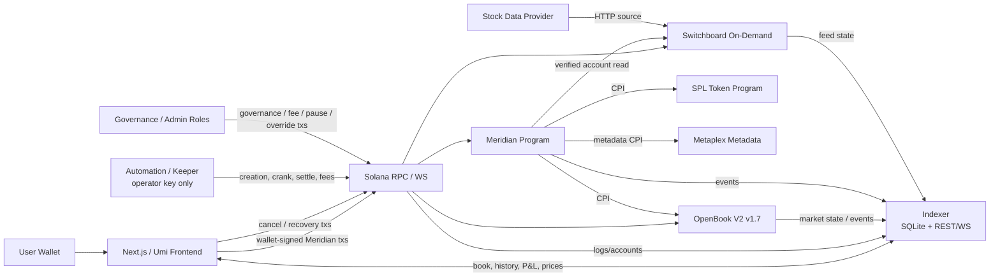
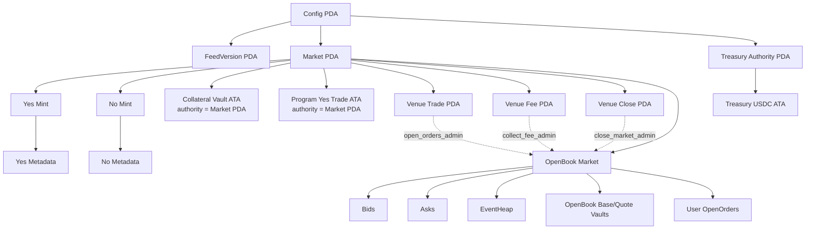
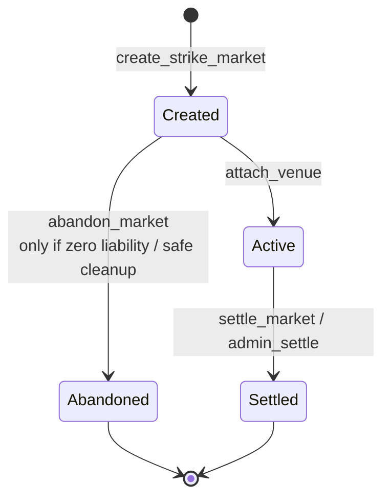
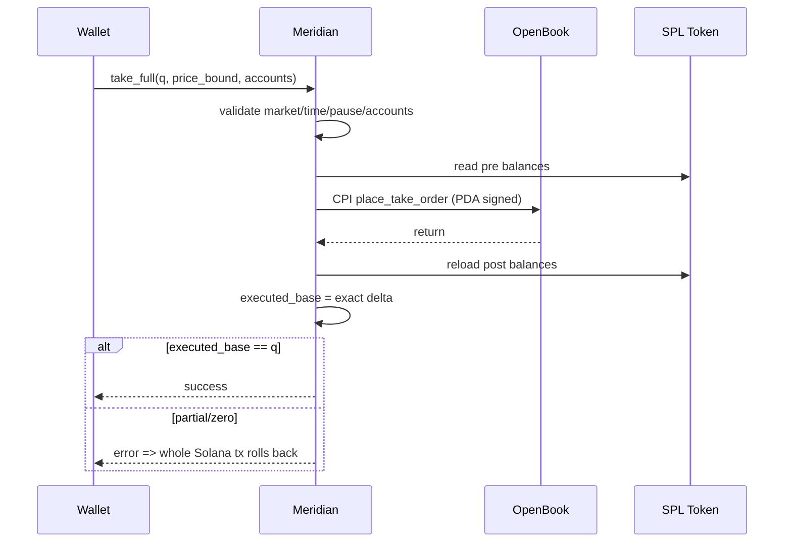
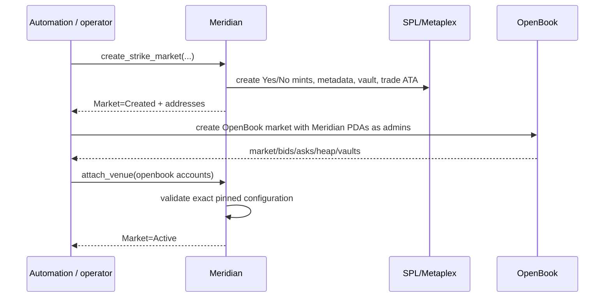
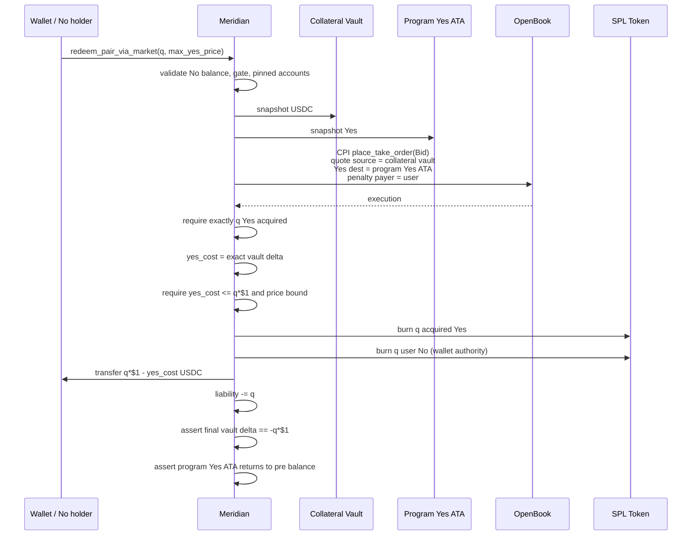
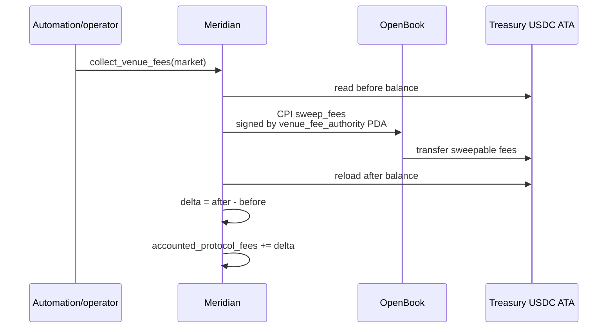
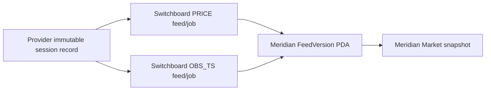
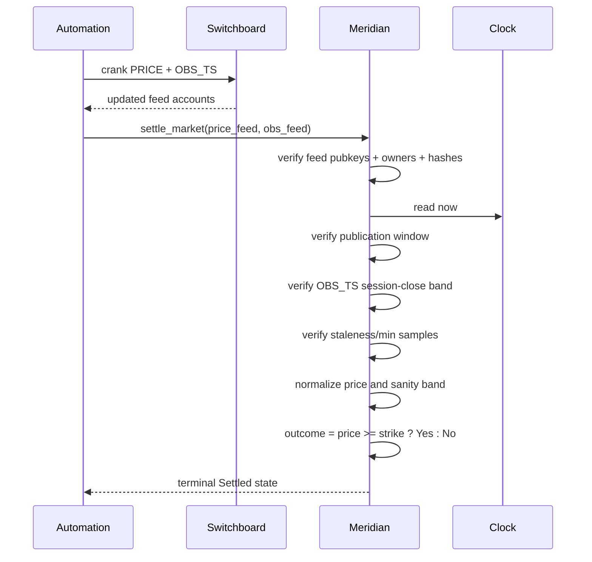

# Meridian — Architecture

**Version:** 1.0  
**Date:** 2026-08-19  
**Status:** Frozen architecture baseline for implementation  
**Frozen PRD:** `PRD.md` / Meridian Implementation Plan v0.6  
**Frozen PRD SHA-256:** `fceea3d3a72ee22b95da3703e824c6b514158daa4c5f5164d110681e1d827231`  
**Source specification:** `meridian-spec.md` (converted from the source PDF; PDF remains source of truth)  
**Primary venue:** OpenBook V2 deployed v1.7  
**Target:** Solana devnet

---

## 0. Document Authority and Change Control

This document is the implementation architecture derived from the frozen Meridian PRD v0.6.

The PRD owns **product behavior and acceptance requirements**. This document owns **component boundaries, account topology, trust boundaries, CPI composition, service responsibilities, data flows, failure handling, and implementation structure**.

If this document conflicts with the frozen PRD, the PRD wins.

### 0.1 Frozen product decisions

Implementation MUST NOT change these without reopening the PRD:

- Solana devnet + Anchor/Rust.
- OpenBook V2 is the V1 CLOB.
- One Yes/USDC OpenBook market per strike.
- Meridian PDA is the mandatory OpenBook `open_orders_admin`.
- OpenBook market expiry is `close_ts - 1`.
- All V1 limit orders are `PostOnly`.
- Market actions use full-fill-or-revert semantics.
- Minting is gated to `Active && mint_open_ts <= now < close_ts && !paused`.
- Buy No market = pair mint + full Yes sale.
- Buy No limit = pair mint + PostOnly Yes ask in one wallet approval.
- Sell No market = acquire missing Yes + pair redemption.
- Sell No limit is not V1.
- Switchboard PRICE + OBS_TS feed versions are immutable once referenced by a live market.
- Settlement uses the provider-designated official regular-session close for the trading date.
- Collateral uses an accounted liability ledger plus solvency (`raw >= accounted`), not raw-account equality.
- Maker fee is hard-zero in V1.
- Taker fee cap is 101 bps.
- Claim fee cap is 500 bps.
- Position constraints are frontend-enforced.
- Devnet end-to-end is a pass requirement.
- M0 gates G1–G10 are mandatory before full implementation.

### 0.2 Architecture-level choices frozen by this document

The following are implementation details established here. Changing them requires an Architecture revision but does not require a PRD revision unless user-visible behavior changes:

- canonical Meridian PDA seed scheme;
- immutable `FeedVersion` records live in separate Meridian PDA accounts;
- collateral vault and transient Yes trading account use the Meridian Market PDA as token authority;
- treasury uses a dedicated Treasury Authority PDA;
- indexer is read-only and never participates in custody or protocol authority;
- automation holds only the `operator` hot key;
- on-chain CPI targets are allowlisted;
- event/indexer APIs and failure-mode boundaries below.

---

## 1. Architecture Goals

### 1.1 Correctness

The architecture must make the following properties easier to prove than to violate:

1. every outstanding $1 liability is collateralized;
2. Yes + No settlement payout is exactly $1;
3. no order can be created outside the trading window or while paused;
4. no OpenBook account supplied by a client can redirect Meridian custody or fee flows;
5. settlement cannot accept a fresh publication of an old closing observation;
6. live-market terms cannot be changed retroactively;
7. partial synthetic execution cannot persist;
8. protocol fees cannot be confused with collateral or donations.

### 1.2 Non-custodial boundaries

Meridian may control program-owned vaults required for fully collateralized issuance, but:

- user wallet signing is required for user-owned token burns/transfers;
- automation cannot withdraw collateral;
- governance cannot rewrite live-market settlement rules;
- indexer/frontend never hold signing authority;
- OpenBook custody is limited to user-created OpenOrders balances and venue vault mechanics;
- all recovery exits remain available when directional trading is paused.

### 1.3 Operational clarity

The architecture separates:

- **write path:** wallet/automation -> Meridian/OpenBook/Switchboard on Solana;
- **read path:** Solana/OpenBook/Switchboard -> indexer -> REST/WS -> frontend;
- **automation path:** operator jobs + EventHeap keeper + settlement orchestration;
- **governance path:** cold/separate authorities, not service hot keys.

---

## 2. System Context



### 2.1 Sources of truth

| Domain | Source of truth |
|---|---|
| Yes/No ownership | SPL token accounts |
| collateral liability | Meridian `Market.collateral_liability_units` |
| raw collateral | SPL collateral vault balance |
| order book | OpenBook market/bids/asks |
| resting/open order ownership | OpenBook OpenOrders accounts |
| market lifecycle | Meridian `Market.state` + timestamps |
| venue expiry | OpenBook `time_expiry`, cross-checked by Meridian |
| settlement outcome | Meridian `Market.outcome` |
| oracle evidence | snapshotted Switchboard feed accounts + hashes |
| protocol fee accounting | Meridian Config ledgers |
| historical P&L | indexer, advisory/read-side only |
| UI position constraint | frontend balance check, not consensus state |

---

## 3. Trust Boundaries

### 3.1 Untrusted inputs

Treat all of the following as attacker-controlled:

- browser/frontend arguments;
- RPC responses until account ownership/data are validated;
- user-supplied Solana accounts;
- OpenBook market/account addresses supplied by clients;
- OpenOrders accounts supplied by transaction builders;
- remaining maker accounts supplied for inline settlement;
- oracle account addresses supplied to `settle_market`;
- timestamps/price bounds supplied by clients;
- token destination/source accounts;
- referrer accounts;
- indexer output;
- automation request payloads.

The program derives or validates all security-sensitive identities on-chain.

### 3.2 Trusted but constrained dependencies

#### Meridian program

Protocol trust root for:

- collateral accounting;
- token mint/burn authority;
- trading authorization;
- market snapshots;
- settlement;
- fee accounting.

#### OpenBook V2

Trusted only for the pinned/deployed venue behavior proven by M0:

- matching;
- OpenOrders custody/accounting;
- market expiry;
- event heap behavior;
- fee math.

Meridian MUST validate the exact attached market configuration before using it.

#### Switchboard

Trusted for delivery of the exact immutable feed jobs snapshotted by the market. Meridian still validates:

- feed identity;
- owner program;
- feed hash;
- publication time;
- observation time;
- sample/freshness;
- price normalization/band.

#### Stock-data provider

External truth source for official close. Provider selection remains an open PRD input and must pass M3 same-record calibration.

### 3.3 Privileged roles

| Role | Hot/cold posture | Powers | Explicitly cannot do |
|---|---|---|---|
| `operator` | hot automation key | create/add/attach markets, keeper orchestration, permissionless settlement submit, fee collection | change live terms, manual override, withdraw collateral |
| `fee_admin` | separate | future fee config, fee/surplus withdrawals | settlement override, collateral liability mutation |
| `pause_authority` | separate | global/per-market pause; optionally emergency venue expiry if M0 approves | settle manually, change fees |
| `override_authority` | cold/separate | delayed `admin_settle` only | normal market creation/trading |
| `governance` | cold-ish | role rotation, future params, feed version registration/activation | rewrite existing Market snapshots |
| program upgrade authority | devnet deployer | program upgrade | production posture is out of V1; mainnet requires multisig policy |

---

## 4. Component Architecture

### 4.1 `programs/meridian`

Responsibilities:

- config + role validation;
- feed-version registry;
- strike Market lifecycle;
- Yes/No mint/metadata/vault creation;
- collateral liability accounting;
- mint/pair redemption/outcome redemption;
- mandatory OpenBook order gateway;
- OpenBook CPI adapter;
- settlement validation;
- fee/surplus accounting;
- events.

Must not contain:

- HTTP calls;
- NYSE calendar logic;
- P&L/history calculations;
- arbitrary external CPI addresses;
- frontend-derived authority assumptions.

### 4.2 `packages/common`

Pure/shared TypeScript domain logic:

- ticker enum;
- strike engine;
- NYSE calendar;
- fixed-point helpers;
- fee conversion;
- address derivation;
- generated Meridian client;
- transaction composition helpers;
- shared error/result types.

No secrets.

### 4.3 `packages/openbook-adapter`

Boundary around OpenBook client/types.

Responsibilities:

- decode pinned OpenBook accounts;
- derive OpenOrdersIndexer/OpenOrders addresses using official client rules;
- build recovery instructions such as cancel and consumed-event helpers;
- build account lists for Meridian wrappers;
- expose normalized market/book/OpenOrders types;
- golden-test against pinned v1.7 client.

Application code outside this package does not import raw OpenBook/web3.js/Anchor venue types.

### 4.4 `services/automation`

Single service may host multiple workers, but responsibilities remain logically separated:

- strike creation scheduler;
- intraday `add_strike` runner;
- EventHeap keeper;
- oracle preflight;
- Switchboard crank orchestration;
- settlement runner;
- venue fee collector;
- post-close cleanup;
- alerts/health.

Only `OPERATOR_KEYPAIR_PATH` is loaded by the service.

### 4.5 `services/indexer`

Read-only projection layer.

Responsibilities:

- consume Meridian logs;
- consume/decode OpenBook state/events;
- discover per-wallet OpenOrders through OpenOrdersIndexer;
- maintain order-book ladder;
- subscribe to Switchboard price accounts for live underlying display;
- calculate platform-execution P&L;
- expose REST/WS;
- expose EventHeap health.

It owns no protocol key and cannot write protocol state.

### 4.6 `app`

Next.js + Umi.

Responsibilities:

- wallet connection;
- market discovery;
- real-time price/book display;
- Yes/No mirrored view;
- position constraints;
- transaction construction/signing;
- recovery UX;
- portfolio/history.

All order creation calls Meridian, never OpenBook directly.

---

## 5. On-Chain Account Topology



### 5.1 Canonical Meridian PDA seeds

These are architecture-level constants:

```text
Config:
  ["config"]

Market:
  ["market", ticker_u8, strike_1e6_le_u64, trading_day_yyyymmdd_le_u32]

Yes mint:
  ["yes", market_pubkey]

No mint:
  ["no", market_pubkey]

Treasury authority:
  ["treasury-authority"]

FeedVersion:
  ["feed-version", ticker_u8, version_id_le_u32]

Venue trade authority:
  ["venue-trade", market_pubkey]

Venue fee authority:
  ["venue-fee", market_pubkey]

Venue close authority:
  ["venue-close", market_pubkey]
```

Token accounts:

```text
collateral_vault =
  ATA(owner = Market PDA, mint = quote_mint)

program_yes_trade_ata =
  ATA(owner = Market PDA, mint = yes_mint)

treasury =
  ATA(owner = Treasury Authority PDA, mint = quote_mint)
```

Changing any seed after deployment is a breaking account-address migration.

### 5.2 Account ownership matrix

| Account | Owning program | Authority / signer |
|---|---|---|
| Config | Meridian | role checks |
| FeedVersion | Meridian | immutable after creation |
| Market | Meridian | program |
| Yes/No Mint | SPL Token | Market PDA mint authority |
| Yes/No ATA | SPL Token | wallet / program-specific owner |
| metadata | Metaplex | immutable |
| collateral vault | SPL Token | Market PDA |
| program Yes trade ATA | SPL Token | Market PDA |
| treasury | SPL Token | Treasury Authority PDA |
| OpenBook market/book/heap/vaults | OpenBook | configured admins / OpenBook |
| OpenOrders | OpenBook | user owner/delegate |
| Switchboard feed | Switchboard | external feed authority; identity/hash snapshotted |

### 5.3 Mint policy

Yes and No:

- classic SPL Token;
- 6 decimals;
- mint authority = Market PDA;
- no freeze authority;
- metadata immutable;
- token creation only through `mint_pair`.

No Token-2022 extension is assumed.

---

## 6. Meridian Data Model

### 6.1 Config

Logical fields:

```text
roles:
  governance
  pending_governance
  operator
  fee_admin
  pause_authority
  override_authority

global:
  quote_mint
  paused

fees:
  current fee configuration
  future-day activation record
  accounted_protocol_fees
  accounted_surplus

settlement defaults:
  current settlement parameters
  future-day activation record

feeds:
  active_feed_version_pubkey[7]
```

The full immutable feed history is stored in separate `FeedVersion` PDAs rather than resizing Config indefinitely.

Compile-time constants:

```text
MIN_OVERRIDE_DELAY_SECS = 3600
MAX_TAKER_FEE_BPS       = 101
MAX_CLAIM_FEE_BPS       = 500
MAKER_FEE_BPS           = 0
```

### 6.2 FeedVersion

```text
version_id: u32
ticker: u8
provider_id
price_feed
price_feed_hash
obs_ts_feed
obs_ts_feed_hash
activated_day
```

Rules:

- append-only;
- never modified after registration;
- Config may activate a different version only for future markets;
- a live Market stores its exact FeedVersion fields.

### 6.3 Market

Use explicit fields; do not serialize a generic parameter blob.

```text
identity:
  ticker
  strike_1e6
  trading_day
  prev_close_1e6

lifecycle:
  mint_open_ts
  trade_open_ts
  close_ts
  state
  paused

outcome:
  settlement_price_1e6
  outcome
  settled_ts
  admin_settled

assets:
  yes_mint
  no_mint
  collateral_vault
  program_yes_trade_ata

venue:
  openbook_market
  bids
  asks
  event_heap
  openbook_base_vault
  openbook_quote_vault
  venue_trade_authority_bump
  venue_fee_authority_bump
  venue_close_authority_bump

feed snapshot:
  feed_version_id
  provider_id
  price_feed
  price_feed_hash
  obs_ts_feed
  obs_ts_feed_hash

settlement snapshot:
  finalization_delay_secs
  settle_window_secs
  obs_tail_secs
  obs_window_secs
  min_samples
  max_stale_slots
  max_price_band_bps
  override_delay_secs

fee snapshot:
  taker_fee_bps
  claim_fee_bps

accounting:
  collateral_liability_units
```

### 6.4 State machine



Time overlays on `Active`:

```text
before mint_open_ts                -> no mint
mint_open_ts .. trade_open_ts      -> mint allowed, no trading
trade_open_ts .. close_ts          -> mint + trading allowed
at/after close_ts                  -> no mint, no order creation
settled                            -> outcome redemption only
```

Pause overlays Active:

- blocks minting;
- blocks directional trading;
- does not block cancel, event consumption, fund settlement, or appropriate redemption.

---

## 7. OpenBook Integration Boundary

### 7.1 Pinned dependency

V1 expects:

```text
program id:
opnb2LAfJYbRMAHHvqjCwQxanZn7ReEHp1k81EohpZb

deployed tag:
v1.7

release commit:
796a470

release build SHA-256:
a3eb0fad20778b31a20c6b98e4e61b8e9425ccbfb27a96f8165f70c0381bafa8
```

These values are inputs to G1 but are independently verified before implementation relies on them.

### 7.2 Integration implementation

Preferred:

1. MIT `cpi`/`client` interface compatible with pinned deployment.
2. If incompatible with Meridian's Anchor version, build a minimal adapter only from MIT IDL/client/account-layout interfaces.
3. Golden-test:
   - discriminator;
   - serialized arguments;
   - account order;
   - signer/writable flags;
   - program ID.

Do not derive fallback code from GPL implementation source.

### 7.3 OpenBook market creation

Per strike:

```text
base_mint            = Yes mint
quote_mint           = Config.quote_mint
open_orders_admin    = venue_trade_authority PDA
collect_fee_admin    = venue_fee_authority PDA
consume_events_admin = None
close_market_admin   = venue_close_authority PDA
time_expiry          = close_ts - 1
oracle_a             = None
oracle_b             = None
maker_fee            = 0
taker_fee            = taker_fee_bps * 100
```

Lot parameters:

```text
base_lot_size  = 1_000_000 base atoms
quote_lot_size = 10_000 quote atoms
price_lots     = cents
```

### 7.4 Attach-time validation

`attach_venue` accepts a venue only if every invariant matches:

```text
owner                == PINNED_OPENBOOK_PROGRAM_ID
base_mint            == Market.yes_mint
quote_mint           == Config.quote_mint
base_lot_size        == 1_000_000
quote_lot_size       == 10_000
open_orders_admin    == derived venue-trade PDA
collect_fee_admin    == derived venue-fee PDA
consume_events_admin == None
close_market_admin   == derived venue-close PDA
time_expiry          == close_ts - 1
maker_fee            == 0
taker_fee            == market.taker_fee_bps * 100
oracle_a             == None
oracle_b             == None
```

The program also stores and pins:

- bids;
- asks;
- EventHeap;
- OpenBook base vault;
- OpenBook quote vault.

After attachment, no client-provided replacements are accepted.

### 7.5 Mandatory order gateway

Every supported order creation is a Meridian instruction.

Common gate:

```text
Market.state == Active
trade_open_ts <= Clock.now < close_ts
!Config.paused
!Market.paused

openbook_program == pinned program id
openbook_market  == stored market
bids/asks/heap   == stored accounts
venue vaults     == stored vaults
open_orders_admin == derived venue-trade PDA

price_lots in [1, 99]
quantity is integral whole-token lots
```

Meridian uses `invoke_signed` for `venue_trade_authority`.

A direct OpenBook order-creation call cannot produce the PDA signature and therefore cannot trade.

---

## 8. Order Execution Architecture

### 8.1 Limit order

V1 limit orders are always:

```text
PostOnly
self_trade_behavior = AbortTransaction
expiry_timestamp = close_ts - 1
```

The client cannot override these.

The wrapper requires evidence that an order actually posted. A crossing PostOnly request fails and the entire transaction reverts.

### 8.2 Market action / `take_full`

`place_take_order` may partial-fill, so Meridian adds a post-CPI invariant.



Never rely on client-side fill estimates for solvency.

### 8.3 EventHeap inline-first policy

For market actions:

1. indexer identifies expected maker OpenOrders from current book nodes;
2. builder supplies up to 15 as remaining accounts;
3. OpenBook can settle those makers inline;
4. if heap pressure exceeds threshold, prepend bounded `consume_events`;
5. if safe transaction cannot fit compute/account/byte limits, fail closed with retriable backlog error.

The indexer is a performance helper, not an authority. Meridian/OpenBook validate the supplied accounts.

### 8.4 Keeper SLOs

Initial thresholds from frozen PRD:

| Window | Heap depth | Oldest event |
|---|---:|---:|
| 09:30–15:55 | <25% | <5s |
| 15:55–close | <10% | <2s |
| >=50% | priority-fee escalation | — |
| >=75% | critical alert / UI warning | — |

G6 may tighten these after measurement.

---

## 9. User Transaction Flows

### 9.1 Market creation



Minting is still blocked until `mint_open_ts`; trading is blocked until `trade_open_ts`.

### 9.2 Buy Yes — market

```text
wallet
  -> Meridian.take_full(Bid, q, max_yes_price)
  -> OpenBook place_take_order
  -> Yes to user, USDC from user
  -> exact-fill assertion
```

### 9.3 Buy Yes — limit

```text
wallet transaction:
  OpenOrders setup if first use
  -> Meridian.place_limit_order(PostOnly Bid)
```

First-use size must pass G7.

### 9.4 Sell Yes

Market:

```text
Meridian.take_full(Ask, q, min_yes_price)
```

Limit:

```text
Meridian.place_limit_order(PostOnly Ask)
```

### 9.5 Buy No — market

```mermaid
sequenceDiagram
    participant W as Wallet
    participant M as Meridian
    participant O as OpenBook

    W->>M: mint_pair(q)
    M-->>W: mint q Yes + q No; deposit $1*q
    W->>M: take_full(Ask q, min_yes_price)
    M->>O: CPI sell Yes
    alt full Yes sale
        O-->>M: complete
        M-->>W: retain No + receive Yes sale proceeds
    else insufficient fill
        M-->>W: error
        Note over W,M,O: Entire wallet transaction rolls back,<br/>including mint_pair
    end
```

Both instructions are composed in one wallet transaction.

### 9.6 Buy No — limit

Strict one-approval composite:

```text
[
  create OpenOrdersIndexer if absent,
  create OpenOrdersAccount if absent,
  mint_pair(q),
  place_limit_order(PostOnly Ask @ 100 - desired_no_price)
]
```

Transaction v0 + Address Lookup Table is the preferred first-use size mitigation.

If this cannot fit first-use in one approval, G7 fails and requires explicit stakeholder waiver before a two-approval implementation.

### 9.7 Sell No — market / `redeem_pair_via_market`



Collateral vault pays only the economically required Yes acquisition and final pair payout. It never pays SOL/rent/EventHeap penalties.

---

## 10. Collateral and Token Accounting

### 10.1 Liability model

`collateral_liability_units` counts unresolved $1 obligations.

```text
mint_pair(q)
  liability += q

redeem_pair(q)
  liability -= q

redeem_pair_via_market(q)
  liability -= q

settlement
  liability unchanged

losing redeem(q)
  liability unchanged

winning redeem(q)
  liability -= q
```

### 10.2 Solvency

```text
accounted_collateral =
  collateral_liability_units * 1_000_000

raw_collateral_vault_balance >= accounted_collateral

collateral_surplus =
  raw_collateral_vault_balance - accounted_collateral
```

Unsolicited transfers increase surplus only.

### 10.3 Surplus handling

`skim_collateral_surplus`:

- computes raw excess on-chain;
- moves only excess to Treasury;
- increments `accounted_surplus`;
- cannot reduce accounted collateral.

### 10.4 Outcome redemption

Winner:

```text
gross = winning token atoms
fee = min(gross, ceil(gross * claim_fee_bps / 10_000))
user receives gross - fee
protocol fee -> Treasury
liability decreases by gross-contract units
```

Loser:

```text
burn losing tokens
pay 0
liability unchanged
```

Minimum redemption is one token atom.

---

## 11. Fee Architecture

### 11.1 Supported V1 fees

```text
maker_fee_bps = 0 hard-coded
taker_fee_bps <= 101
claim_fee_bps <= 500
```

OpenBook conversion:

```text
openbook_fee_units = taker_fee_bps * 100
```

### 11.2 Referral policy

Supported order surfaces are structured so referral payout is zero:

- market: `place_take_order`, no referrer account;
- limit: PostOnly, does not become taker;
- OpenOrders fund settlement: Meridian `settle_openbook_funds` pins `referrer_account=None`.

A hostile direct `settle_funds` route is part of G9. Nonzero taker fees stay disabled unless G9 proves supported paths cannot accumulate redirectable referral rebate.

### 11.3 Venue fee collection



No indexer event is trusted to mutate fee ledgers.

### 11.4 Treasury invariant

```text
treasury_balance >=
  accounted_protocol_fees + accounted_surplus
```

Withdrawals decrement the corresponding ledger, preserving provenance.

---

## 12. Oracle and Settlement Architecture

### 12.1 Feed versioning

Each ticker has an active immutable FeedVersion.



Changing a job/provider means creating new feeds and a new FeedVersion. Do not mutate a feed referenced by an unsettled Market.

### 12.2 Provider same-record contract

M3 must prove PRICE and OBS_TS derive from the same immutable provider object keyed by:

```text
ticker
session_date
```

A provider that cannot meet this is rejected.

### 12.3 Settlement sequence



### 12.4 Timing

```text
close + 5m  -> normal settlement starts
close + 10m -> SLO incident if unresolved
close + 15m -> automated retry window ends
close + >=1h -> override becomes eligible
```

Early-close days use the same relative schedule against calendar-derived `close_ts`.

### 12.5 Manual override

`admin_settle`:

- only `override_authority`;
- only unsettled market;
- only after snapshotted delay;
- snapshotted delay cannot be below compile-time 3600s floor;
- emits explicit admin-settlement event;
- does not change the oracle configuration.

---

## 13. Automation Architecture

### 13.1 Scheduling

The calendar module is the single source of:

- US trading day validity;
- DST-aware ET times;
- NYSE holidays;
- early-close timestamps.

The on-chain program trusts only timestamps already snapshotted into Market, not off-chain calendar calculations at execution time.

### 13.2 Jobs

#### 08:00 strike generation

- fetch previous close;
- compute ±3/6/9%;
- round nearest $10;
- dedupe;
- optional ATM based on frozen configuration;
- validate required META/AAPL vectors in test suite.

#### 08:30 market creation

Per strike:

1. `create_strike_market`;
2. create OpenBook market;
3. `attach_venue`;
4. verify `Active`.

Market missing `Active` by mint-open time is not mintable.

#### Intraday add strike

`add_strike` uses the same creation/snapshot/venue-attachment pipeline. It does not mutate existing strikes.

#### Continuous EventHeap keeper

- read heap health;
- discover oldest maker OpenOrders;
- batch permissionless `consume_events`;
- escalate priority fee per threshold;
- emit metrics/alerts.

#### 15:55 oracle preflight

Advisory:

- provider reachable;
- feed version healthy;
- optional independent-source sanity comparison.

This does not alter on-chain settlement requirements.

#### close+5 settlement

- crank feed pair per ticker;
- settle strikes in idempotent batches.

#### post-close

- drain heap;
- collect venue fees;
- cleanup eligible venue state.

---

## 14. Indexer and Read Model

### 14.1 Ingestion

Subscriptions:

- Meridian program logs;
- OpenBook market/bids/asks/EventHeap;
- OpenBook logs/events;
- Switchboard feed accounts;
- signatures for backfill.

### 14.2 OpenOrders discovery

For a wallet:

1. derive/read OpenOrdersIndexer according to pinned OpenBook client;
2. enumerate associated OpenOrders accounts;
3. decode only accounts belonging to Meridian-attached OpenBook markets;
4. cache mapping by wallet + market.

Never discover accounts by trusting a frontend list.

### 14.3 Persistence

SQLite is sufficient for V1.

Minimum tables/projections:

```text
markets
market_snapshots
fills
wallet_executions
open_orders
positions
settlements
underlying_prices
crank_health
ingestion_cursor
```

Storage schema is a projection; it is rebuildable from chain/backfill where source data is available.

### 14.4 APIs

Frozen endpoints:

```text
GET /markets/:day
GET /book/:market
WS  /book/:market
GET /history/:wallet
GET /positions/:wallet
GET /open-orders/:wallet
GET /crank-health
```

`GET /markets/:day` includes read-model fields needed for:

- live underlying/oracle price;
- active strike count;
- Yes/No implied price/probability;
- lifecycle/settlement status.

### 14.5 Consistency

The indexer is eventually consistent.

Before creating a transaction involving ownership/balance constraints, frontend must refresh authoritative wallet/token state from RPC as needed.

If indexer state is stale enough that a safe market transaction cannot determine remaining maker accounts/heap health, trading may fail closed. Funds remain recoverable directly on-chain.

### 14.6 P&L

Advisory platform-execution P&L:

- transfer in -> unknown basis;
- transfer out -> reduce quantity at average cost, no realized P&L;
- Buy No basis = $1 deposit - net Yes sale + fees;
- Sell No proceeds = $1 - actual Yes acquisition cost;
- unknown basis displayed as unknown.

P&L never affects protocol settlement or collateral.

---

## 15. Frontend Architecture

### 15.1 Layers

```text
UI components
  ↓
domain actions
  ↓
Meridian transaction builders
  ↓
Umi transaction builder / wallet-adapter
  ↓
Solana RPC
```

OpenBook raw types live only in `packages/openbook-adapter`.

### 15.2 Position constraints

Before showing/enabling a directional action:

```text
holds No > 0 -> Buy Yes disabled; guide to Sell No
holds Yes > 0 -> Buy No disabled; guide to Sell Yes
```

Transfers may create both holdings; this is allowed by protocol and handled through pair redemption.

### 15.3 Trade-page data

Trade page combines:

- Market identity/state from Meridian/indexer;
- live underlying price from Switchboard projection;
- OpenBook ladder;
- mirrored No ladder (`No ~= 1 - Yes`);
- wallet token balances;
- OpenOrders/free balances;
- heap health;
- countdown;
- fee disclosures.

### 15.4 Required first-use path

Buy-No limit first-use must attempt one transaction containing:

```text
OpenOrdersIndexer creation if absent
OpenOrders creation if absent
mint_pair
PostOnly limit order
```

Preferred transaction encoding:

- versioned transaction v0;
- Address Lookup Table for stable venue/program accounts.

A two-approval fallback cannot be silently shipped as spec-compliant.

### 15.5 Recovery UX

Portfolio must distinguish:

- wallet Yes/No balances;
- resting OpenBook orders;
- OpenBook free funds pending settlement;
- settled redeemable outcomes.

Recovery action may compose:

```text
cancel
consume events if needed
settle_openbook_funds(referrer=None)
redeem_pair / redeem_outcome as applicable
```

If account/CU limits prevent one transaction, recovery may be split; this does not alter trading one-approval requirements.

---

## 16. Security Architecture

### 16.1 CPI allowlist

Meridian CPIs only to pinned/expected programs:

- SPL Token;
- Associated Token Account program as required;
- Metaplex Token Metadata;
- OpenBook V2 pinned program.

Switchboard settlement is a verified account-read path; feed update instructions are submitted by automation separately.

No arbitrary program ID may enter a Meridian instruction.

### 16.2 Account pinning

Security-sensitive OpenBook accounts are stored on Market at attachment and compared on every CPI.

Do not accept client-selected:

- OpenBook market;
- bids;
- asks;
- EventHeap;
- venue vaults;
- admin PDAs;
- collateral vault;
- program Yes ATA;
- treasury;
- token mints;
- OpenBook program ID.

### 16.3 Post-CPI validation

After OpenBook CPI:

- reload token accounts;
- compute exact deltas;
- assert full fill;
- assert price/cost bound;
- assert no transient program inventory remains where required;
- error on mismatch, relying on Solana atomic rollback.

### 16.4 Integer math

Use checked integer math only.

- USDC/Yes/No atoms: `u64`.
- intermediate multiplication: use checked `u128` where needed.
- strike/oracle normalization: fixed-point 1e6.
- no floating point on-chain.
- fee ceil implemented with overflow-safe integer formula.

### 16.5 Collateral isolation

The operator/governance/fee keys have no arbitrary collateral withdrawal instruction.

Only protocol state transitions can reduce accounted collateral:

- pair redemption;
- Sell-No pair redemption;
- winning outcome redemption.

Surplus withdrawal first proves `raw > accounted`.

### 16.6 SOL isolation

Collateral vault is an SPL token account and never a SOL payer.

EventHeap penalties/rent/priority fees are paid by:

- user wallet for user transaction;
- operator wallet for keeper/automation.

### 16.7 Pause guarantees

Pause blocks:

- minting;
- Buy Yes;
- Buy No;
- Sell Yes;
- Sell No;
- new limit/market orders.

Pause does not block:

- cancel;
- consume events;
- wrapped `settle_openbook_funds`;
- pre-settlement pair redemption;
- post-settlement outcome redemption.

### 16.8 Emergency venue expiry

`emergency_expire_venue` is included only if G3/M0 proves exact behavior and authority safety.

It is:

- irreversible for the day's venue;
- not normal pause;
- evented;
- reserved for venue-level circuit breaking.

---

## 17. Events

The indexer should not infer protocol transitions solely from token balance deltas.

Meridian emits stable events for at least:

```text
ConfigInitialized
RoleRotationProposed
RoleAccepted
FeesScheduled
ParamsScheduled
FeedVersionRegistered
FeedVersionActivated

MarketCreated
VenueAttached
MarketAbandoned
MarketPaused
MarketUnpaused
VenueEmergencyExpired

PairMinted
PairRedeemed
PairRedeemedViaMarket

LimitOrderAuthorized
MarketTakeAuthorized

MarketSettled
MarketAdminSettled
OutcomeRedeemed

VenueFeesCollected
CollateralSurplusSkimmed
TreasurySurplusCaptured
ProtocolFeesWithdrawn
SurplusWithdrawn
```

Event payloads include stable Market pubkey and relevant quantitative fields.

OpenBook remains source of truth for venue fill/order events; Meridian trading events indicate authorization/composite success, not a replacement matching ledger.

---

## 18. Failure Modes and Recovery

| Failure | Safety property | Recovery |
|---|---|---|
| OpenBook market creation fails | no mint/trade before `Active` | retry; abandon if safely empty |
| attach validation fails | malicious/misconfigured venue never active | fix/recreate venue |
| indexer down | no custody impact | trading UI may degrade/fail closed; chain recovery available |
| keeper behind | no partial synthetic exposure | inline makers + pre-consume; backlog error; keeper escalation |
| EventHeap saturated | transaction fails rather than partial synthetic state | drain heap; retry |
| oracle stale/low-quality | settlement rejected | retry through +15m; delayed override |
| provider unavailable | settlement rejected | retry; delayed manual override |
| automation key lost | no collateral/admin compromise | permissionless normal settlement remains possible; rotate operator |
| fee-admin compromised | cannot touch collateral liability | rotate role; withdrawals limited to accounted treasury ledgers |
| pause key compromised | can halt trading/minting, not steal funds | rotate role; recovery exits remain |
| override key compromised | cannot settle before >=1h floor | rotate; audit event |
| direct USDC donation to vault | solvency improves; no DoS | classify/skim only excess |
| direct token transfer creates Yes+No | economically harmless | pair redemption available |
| stale frontend book | limit/price request may fail | refresh/retry; on-chain price bounds protect trade |
| OpenBook post-only would cross | whole tx reverts | UI asks Market or non-crossing limit |
| partial taker liquidity | whole tx reverts | retry with smaller size/different bound |
| user has unsettled OpenBook free balance | assets remain OpenBook-owned by user | wrapped settle-funds |
| post-close resting orders remain | cannot execute due to hard gate + market expiry | cancel/prune/settle/cleanup |

---

## 19. Observability

### 19.1 Protocol metrics

- markets Created/Active/Settled/Abandoned;
- unsettled markets after +5/+10/+15;
- settlement reason failures by category;
- collateral raw/accounted/surplus per market;
- treasury raw/protocol-fee/surplus ledgers;
- admin override count;
- pause state.

### 19.2 Venue metrics

- EventHeap depth %;
- oldest event age;
- consume-events success/failure;
- market-action rollback rate due to partial fills;
- market-action backlog failures;
- OpenOrders free balance age;
- venue fee sweep delta;
- expired venues not cleanup-ready.

### 19.3 Service metrics

- automation last successful job per scheduler;
- RPC error rate;
- WS reconnect count;
- indexer lag slots;
- backfill cursor;
- provider latency/error rate;
- Switchboard update status;
- operator SOL balance.

### 19.4 Alerts

At minimum:

- market not Active by mint-open;
- heap >=50%;
- heap >=75%;
- oldest event beyond SLO;
- any unsettled market at close+10;
- oracle rejected repeatedly;
- override path armed;
- collateral `raw < accounted` (critical);
- treasury `raw < accounted_protocol_fees + accounted_surplus` (critical);
- indexer lag beyond configured threshold;
- operator wallet low SOL.

Exact alert destination remains an open PRD input.

---

## 20. Deployment Topology

### 20.1 Local development

```text
local validator
  + Meridian program
  + cloned/pinned OpenBook v1.7
  + test quote mint
  + MockOracle
  + automation
  + indexer
  + Next.js
```

Used by `make dev` and deterministic `make demo`.

### 20.2 Devnet pass topology

```text
Solana devnet
  Meridian deployed program
  OpenBook deployed v1.7
  Switchboard devnet feed accounts
  devnet USDC or configured dev quote

off-chain
  public stock-data provider / public HTTPS demo source
  automation service
  indexer + SQLite
  Next.js frontend
```

`make demo-devnet` is the required pass path.

A localhost/RFC1918 data source is invalid for remote Switchboard operation.

### 20.3 Secrets

Only service processes that need a role load that key.

Automation:

```text
OPERATOR_KEYPAIR_PATH
```

Governance/fee/pause/override keys are never bundled into the automation process or frontend.

---

## 21. Repository Architecture

```text
meridian/
├─ programs/
│  └─ meridian/
│     ├─ src/
│     │  ├─ lib.rs
│     │  ├─ constants.rs
│     │  ├─ error.rs
│     │  ├─ events.rs
│     │  ├─ state/
│     │  │  ├─ config.rs
│     │  │  ├─ feed_version.rs
│     │  │  └─ market.rs
│     │  ├─ instructions/
│     │  │  ├─ admin/
│     │  │  ├─ market/
│     │  │  ├─ trading/
│     │  │  ├─ settlement/
│     │  │  └─ fees/
│     │  ├─ openbook/
│     │  │  ├─ cpi.rs
│     │  │  ├─ validation.rs
│     │  │  └─ math.rs
│     │  └─ oracle/
│     │     └─ switchboard.rs
│     └─ Cargo.toml
│
├─ packages/
│  ├─ common/
│  ├─ meridian-client/          # generated/Codama Umi client
│  └─ openbook-adapter/
│
├─ services/
│  ├─ automation/
│  │  ├─ src/jobs/
│  │  ├─ src/keeper/
│  │  ├─ src/calendar/
│  │  └─ src/alerts/
│  ├─ indexer/
│  │  ├─ src/ingest/
│  │  ├─ src/projections/
│  │  ├─ src/api/
│  │  └─ migrations/
│  └─ demo-source/              # optional public HTTPS synthetic source
│
├─ app/
│  ├─ app/
│  ├─ components/
│  ├─ domain/
│  ├─ data/
│  └─ transactions/
│
├─ scripts/
│  ├─ deploy/
│  ├─ openbook/
│  ├─ feeds/
│  └─ demo/
│
├─ tests/
│  ├─ strike-engine/
│  ├─ program/
│  ├─ openbook-integration/
│  ├─ adversarial/
│  ├─ devnet/
│  └─ playwright/
│
├─ docs/
│  ├─ adr/
│  └─ runbooks/
│
├─ PRD.md
├─ ARCHITECTURE.md
├─ Makefile
└─ .env.example
```

---

## 22. Test Architecture

### 22.1 Unit/domain

- strike rounding/dedupe;
- fee conversions;
- calendar;
- fixed-point math;
- P&L calculations.

### 22.2 Program

LiteSVM/Anchor tests:

- every instruction gate;
- account substitution rejection;
- liability transitions;
- fee/surplus invariants;
- oracle validation;
- role isolation;
- mint/trade boundary timestamps.

### 22.3 OpenBook integration

Local validator with pinned OpenBook deployment behavior:

- universal PDA order gate;
- PostOnly behavior;
- self-trade policy;
- exact expiry;
- full-fill rollback;
- EventHeap inline/consume behavior;
- Sell-No vault-funded path;
- fee/referrer conservation;
- cleanup.

### 22.4 Devnet E2E

Real deployed dependencies:

```text
create -> mint -> quote -> take
-> all four user paths
-> close
-> oracle settle
-> OpenBook settle/cancel
-> redeem
-> fee/account reconciliation
```

### 22.5 Frontend

Playwright:

- wallet connection;
- position constraints;
- live price/contract cards;
- mirrored order book;
- market/limit orders;
- Buy-No first-use one-approval path;
- pause behavior;
- Portfolio recovery;
- settlement/redeem;
- History/P&L.

---

## 23. M0 Architecture Gates

M0 is an architecture validation phase, not feature implementation.

### G1 — Pinned OpenBook build/interface

Verify deployed program metadata, client interface, license-safe CPI path, and golden instruction encoding.

### G2 — Universal PDA order authorization

Prove both maker and taker order creation fail without Meridian PDA and succeed only through Meridian.

### G3 — Time/pause/mint gates

Boundary tests for:

```text
trade_open_ts - 1
trade_open_ts
close_ts - 1
close_ts
close_ts + 1
```

and paused/Settled/Created states.

Evaluate irreversible `set_market_expired` defense-in-depth.

### G4 — Full-fill rollback

Prove partial OpenBook execution followed by Meridian error rolls back all token/OpenBook state.

### G5 — Sell-No pair redemption

Prove:

- exact account pinning;
- vault can only spend through valid attached market;
- user pays SOL penalty;
- exact Yes acquired;
- exact final vault/liability delta;
- transient program Yes inventory returns to baseline;
- self-cross remains solvent.

### G6 — EventHeap

Measure:

- capacity;
- inline maker behavior;
- remaining-account count;
- consume batch size;
- keeper latency;
- saturation behavior.

### G7 — Transaction feasibility

Hard measurements for:

- `create_strike_market` with two metadata CPIs;
- first-use Buy-No limit;
- market actions with 15 remaining maker accounts;
- pre-consume + take;
- Sell-No path;
- recovery/Claim bundles;
- batched settlement.

Measure:

- serialized bytes;
- account count;
- CU;
- v0/ALT compatibility;
- wallet simulation.

### G8 — Rent budget

Measure actual rent for:

- OpenBook market;
- bids;
- asks;
- EventHeap;
- OpenOrders;
- Meridian Market;
- mints;
- metadata;
- token accounts.

Calculate 35/49 markets per day and multi-day unreclaimed worst case.

### G9 — Fee/referrer conservation

Prove supported V1 fee path has zero referral payout and reconcile:

```text
OpenBook charged fee
-> OpenBook sweepable fee
-> Treasury raw delta
-> Meridian accounted_protocol_fees
```

### G10 — Price/lot/order semantics

Golden-test:

- 1–99 cent price mapping;
- whole-token base lot;
- PostOnly crossing rejection;
- self-trade policy;
- order expiry;
- taker fee conversion 0/1/25/100/101 bps.

Failure of any G1–G10 blocks full implementation and requires architecture/PRD disposition.

---

## 24. Open Inputs Preserved from Frozen PRD

Architecture does not decide:

1. stock-data provider;
2. Q1 spec-owner confirmation that pair-redemption family satisfies "tokens destroyed via redeem";
3. ATM strike default on/off;
4. metadata URI policy;
5. alerting destination;
6. business requirement, if any, for nonzero maker fees beyond V1.

The implementation may scaffold configurable hooks, but must not silently resolve these product inputs.

---

## 25. Definition of Architecture Ready

The architecture is ready for build handoff when:

- frozen PRD checksum matches this document;
- no Critical/High architecture review findings remain;
- M0 implementation is scoped exactly to G1–G10;
- repository boundaries match §21;
- no service holds an authority outside its assigned role;
- OpenBook order creation is reachable only through Meridian PDA authorization;
- every collateral-decreasing path maps to an explicit liability transition;
- settlement inputs map to immutable market snapshots;
- devnet demo path does not weaken production validation.

Once those conditions hold, Codex/Claude/Cursor implementation agents should build from:

1. `PRD.md` — product contract;
2. `ARCHITECTURE.md` — system design;
3. `meridian-spec.md` — source specification/reference;
4. tests/gates as executable acceptance evidence.
